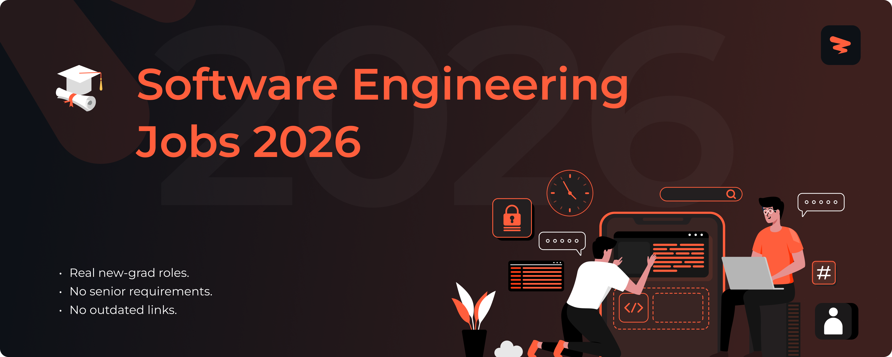

<!-- Banner -->

# Software Engineering Jobs 2026

🚀 Software engineering and IT jobs for new graduates, updated in real time.

> [!TIP]
> 🛠 Help us grow! Add new jobs by submitting an issue! View contributing steps [here](CONTRIBUTING-GUIDE.md).

---

## **Website & Autofill Extension**

Explore Zapply's website and check out:

- Our chrome extension that autofills your job applications in seconds.
- A dedicated job board with the latest jobs for various types of roles.
- User account providing multiple profiles for different resume roles.
- Job application tracking with streaks to unlock commitment awards.

Experience an advanced career journey with us! 🚀

  

## Explore Around

Connect and seek advice from a growing network of fellow students and new grads.

  
  &nbsp;&nbsp;
  
  &nbsp;&nbsp;
  

---

<h3>📱 <strong>Mobile Development</strong></h3>

| Company | Role | Location | Posted | Visa | **Apply** |
|---------|------|----------|--------|------|----------|
| 🏢 **Apple** | iOS Software Development Engineer, Proactive - On-Device | Santa Clara | 8h |  |  |
| 🏢 **Google** | Software Engineer, Mobile iOS, Maps | United States | 18h |  |  |
| 🏢 **Uber** | Software engineer mobile android | Sunnyvale, Califo... | 19h |  |  |
| 🏢 **TikTok** | Technical Support Engineer - Android/iOS SDK | San Jose, CA | 23h |  |  |
| 🏢 **Whatnot** | Android Engineer | New York, NY | 1d | ✅ Sponsor |  |
| 🏢 **Captivation** | Software Engineer 3- Python/Kotlin/Java/Terraform/ElasticSearch/OpenSearch/AWS | Annapolis Junctio... | 1d | ✅ Sponsor |  |
| 🏢 **CLEAR** | iOS Engineer | New York, New Yor... | 1d | ✅ Sponsor |  |
| 🏢 **Apple** | IOS SOFTWARE MANAGER - SpringBoard Wallpapers | San Diego | 2d |  |  |
| 🏢 **Apple** | Software QA Engineer - Swift macOS | San Diego | 2d |  |  |
| 🏢 **Airbnb** | iOS Software Engineer, Airbnb - New Grad | San Francisco, CA... | 2d | ✅ Sponsor |  |
| 🏢 **Anduril** | Software Engineer, Mobile - Android - Tactical, Recon & Strike | Atlanta, Georgia,... | 2d | ✅ Sponsor |  |
| 🏢 **Google** | Software Engineer, Android XR | United States | 2d |  |  |
| 🏢 **Google** | Software Engineer, Gemini Enterprise Mobile, Android | United States | 2d |  |  |
| 🏢 **Motorola Solutions** | Android Applications Developer | Chicago, IL | 2d |  |  |
| 🏢 **Asana** | Mobile Engineer, iOS | New York City | 3d | ✅ Sponsor |  |
| 🏢 **Asana** | iOS, Software Engineer | New York City | 3d | ✅ Sponsor |  |
| 🏢 **Fidelity Investments** | Mobile Engineer (iOS) | Boston, MA | 3d |  |  |
| 🏢 **Ibotta** | iOS Engineer | Denver, CO | 3d |  |  |
| 🏢 **Whatnot** | iOS Engineer, Buyer Growth | Seattle, WA | 4d | ✅ Sponsor |  |
| 🏢 **Whatnot** | iOS Engineer | Seattle, WA | 4d | ✅ Sponsor |  |
| 🏢 **Ramp** | Mobile Engineer, Android | New York, NY ( | 4d |  |  |
| 🏢 **Ramp** | Mobile Engineer, iOS | New York, NY ( | 4d |  |  |
| 🏢 **Notion** | Software Engineer, Mobile Platform (Android) | New York, New York | 4d | ✅ Sponsor |  |
| 🏢 **OpenAI** | iOS Engineer, ChatGPT Mobile Infrastructure | San Francisco | 4d | ✅ Sponsor |  |
| 🏢 **OpenAI** | Android Engineer, ChatGPT Mobile Infrastructure | San Francisco | 4d | ✅ Sponsor |  |
| 🏢 **OpenAI** | iOS Engineer, Monetization | San Francisco | 4d | ✅ Sponsor |  |
| 🏢 **xAI** | Mobile Android Engineer | New York, NY; Pal... | 4d | ✅ Sponsor |  |
| 🏢 **xAI** | Mobile iOS Engineer | New York, NY; Pal... | 4d | ✅ Sponsor |  |
| 🏢 **Twilio** | Android Engineer - P3 - Security + Identity | US | 4d | ✅ Sponsor |  |
| 🏢 **Stripe** | Android Engineer, Terminal Global Payments | San Francisco, CA... | 4d | ✅ Sponsor |  |
| 🏢 **Stripe** | Android Engineer, Terminal OS Platform | San Francisco, Se... | 4d | ✅ Sponsor |  |
| 🏢 **Robinhood** | iOS Engineer | New York, NY | 4d |  |  |
| 🏢 **Robinhood** | iOS Engineer | Menlo Park, CA | 4d |  |  |
| 🏢 **Robinhood** | Android Engineer | Menlo Park, CA | 4d | ✅ Sponsor |  |
| 🏢 **Reddit** | Android Software Engineer, Ad Formats | San Francisco, CA | 4d | ✅ Sponsor |  |
| 🏢 **Reddit** | Android Software Engineer, Ad Formats | Chicago, IL | 4d | ✅ Sponsor |  |
| 🏢 **Reddit** | Android Software Engineer, Ad Formats | United States | 4d | ✅ Sponsor |  |
| 🏢 **WHOOP** | Android Engineer | Boston, MA | 4d | ✅ Sponsor |  |
| 🏢 **Dropbox** | Android Software Engineer, Mobile Experience | US: Select locations | 4d |  |  |
| 🏢 **Cape** | Software Engineer - iOS | New York, NY | 4d | ✅ Sponsor |  |
| 🏢 **Cape** | Software Engineer - Android | New York, NY | 4d | ✅ Sponsor |  |
| 🏢 **Match Group** | Software Engineer, iOS | Palo Alto, Califo... | 4d | ✅ Sponsor |  |
| 🏢 **Match Group** | Software Engineer, iOS | Los Angeles, Cali... | 4d | ✅ Sponsor |  |
| 🏢 **Match Group** | Android Engineer | New York, New York | 4d | ✅ Sponsor |  |
| 🏢 **Asana** | iOS Engineer | New York City | 4d | ✅ Sponsor |  |
| 🏢 **Applied Intuition** | Android Software Engineer - Applications | Sunnyvale, Califo... | 4d | ✅ Sponsor |  |
| 🏢 **Vercel** | Mobile Engineer | New York City | 4d | ✅ Sponsor |  |
| 🏢 **Stripe** | Android Engineer, Terminal Developer Productivity | San Francisco, Se... | 4d | ✅ Sponsor |  |
| 🏢 **Sony Interactive Entertainment** | Mobile Security Engineer (Android) | CA | 4d | ✅ Sponsor |  |
| 🏢 **Point72** | IOS Developer | New York, NY | 4d | ✅ Sponsor |  |
| 🏢 **Fireblocks** | Mobile Engineer | United States | 4d | ✅ Sponsor |  |
| 🏢 **Fireblocks** | Mobile Engineer | Miami, Florida, U... | 4d | ✅ Sponsor |  |
| 🏢 **Speechify** | Software Engineer, iOS Core Product - Washington, DC, USA | Washington, DC, USA | 5d |  |  |
| 🏢 **Speechify** | Software Engineer, iOS Core Product - Long Beach, CA, USA | Long Beach, CA, USA | 5d |  |  |
| 🏢 **Speechify** | Software Engineer, iOS Core Product - Los Angeles, CA, USA | Los Angeles, CA, USA | 5d |  |  |
| 🏢 **WHOOP** | iOS Engineer | Boston, MA | 6d |  |  |

Apply for more jobs at

<h3>🎨 <strong>Frontend</strong></h3>

| Company | Role | Location | Posted | Visa | **Apply** |
|---------|------|----------|--------|------|----------|
| 🏢 **CACI** | Full Stack Web Developer | CO Denver + 2 more | 8h |  |  |
| 🏢 **FloQast** | Web Developer | Los Angeles, Cali... | 11h | ✅ Sponsor |  |
| 🏢 **Apple** | Product Design Engineer | New York City | 11h |  |  |
| 🏢 **Caterpillar** | Marine Hybrid Controls & Software Integration Engineer (Design Engineering Specialist) | Mossville Illinoi... | 12h |  |  |
| 🏢 **Jane Street** | ASIC Physical Design Engineer | New York, New Yor... | 13h |  |  |
| 🏢 **Intrinsic Robotics** | Frontend Software Engineer | Mountain View, Ca... | 23h |  |  |
| 🏢 **TikTok** | Frontend Software Engineer - Global CRM Platform | San Jose, CA | 23h |  |  |
| 🏢 **Latitude AI** | GIS Solutions Analyst - Front End Services | Pittsburgh, PA | 1d | ✅ Sponsor |  |
| 🏢 **Apple** | Software Engineer - Early Career (Front-end) | Austin | 1d |  |  |
| 🏢 **SEL** | Software Engineer - Front End | Chattanooga | 1d |  |  |
| 🏢 **Waymo** | Front-End Software Engineer, Simulation | MountainView, CA,... | 1d |  |  |
| 🏢 **Booz Allen Hamilton** | Front End Software Engineer | McLean, VA | 1d |  |  |
| 🏢 **KBR** | Web Developer | Chantilly, Virginia | 1d |  |  |
| 🏢 **Harvey** | Frontend Platform Engineer | New York | 2d | ✅ Sponsor |  |
| 🏢 **Anduril** | Frontend Software Engineer, Maneuver dominance | Boston, Massachus... | 2d | ✅ Sponsor |  |
| 🏢 **Spotify** | Frontend Engineer - Music | New York, NY | 2d |  |  |
| 🏢 **Apple** | Full Stack Web Developer - Beats | Los Angeles Metro... | 3d |  |  |
| 🏢 **SoFi** | Frontend Engineer, Money | Seattle, WA | 3d | ✅ Sponsor |  |
| 🏢 **Versapay** | Web Developer (Liquid) | United States (Re... | 3d | ✅ Sponsor |  |
| 🏢 **Intrinsic Robotics** | Frontend Robotics Engineer | Mountain View, Ca... | 3d |  |  |
| 🏢 **Fidelity Investments** | Full Stack Engineer- Front End Development | Westlake, TX | 3d |  |  |
| 🏢 **Boeing** | Experienced Software Design Engineer (P-8 Mission Systems) | Kent, WA | 3d |  |  |
| 🏢 **Adobe** | Software Development Engineer - Front End | San Francisco | 3d |  |  |
| 🏢 **Salesforce** | LMTS Front End Engineer, Agentforce Voice | Palo Alto | 3d |  |  |
| 🏢 **Northrop Grumman** | Full Stack Web Developer (AHT) | Ohio | 3d |  |  |
| 🏢 **Whatnot** | Frontend Engineer, Inventory Experience | New York, NY | 4d | ✅ Sponsor |  |
| 🏢 **Zip** | Software Engineer, Frontend (All Levels) | San Francisco | 4d |  |  |
| 🏢 **Ramp** | Software Engineer, Frontend | New York, NY ( | 4d |  |  |
| 🏢 **Ramp** | University Grad   Software Engineer   Frontend | New York, NY ( | 4d |  |  |
| 🏢 **OpenAI** | Frontend Software Engineer, Codex App | San Francisco | 4d | ✅ Sponsor |  |
| 🏢 **OpenAI** | Frontend Engineer, Dotcom (Marketing) | San Francisco | 4d | ✅ Sponsor |  |
| 🏢 **OpenAI** | Frontend Engineer, Financial Web Platform | San Francisco | 4d | ✅ Sponsor |  |
| 🏢 **Mercor** | Software Engineer, Frontend | San Francisco | 4d |  |  |
| 🏢 **EliseAI** | Web Developer | New York City | 4d | ✅ Sponsor |  |
| 🏢 **Virtu Financial** | Software Engineer - Frontend Trading Application (C#/.NET) | New York | 4d | ✅ Sponsor |  |
| 🏢 **LaunchDarkly** | Frontend Engineer, AI Configs | San Francisco Bay... | 4d | ✅ Sponsor |  |
| 🏢 **WHOOP** | Software Engineer I (Frontend, Growth) | Boston, MA | 4d | ✅ Sponsor |  |
| 🏢 **Jane Street** | Front End Software Engineer | New York, New Yor... | 4d |  |  |
| 🏢 **IXL Learning** | Front-End Software Engineer, IXL Product | San Mateo, CA | 4d | ✅ Sponsor |  |
| 🏢 **Glean** | Software Engineer, Frontend | San Francisco Bay... | 4d |  |  |
| 🏢 **Cartesia** | Design Engineer | * | 4d | ✅ Sponsor |  |
| 🏢 **Cloudflare** | Frontend Engineer, AI Crawl Control | Hybrid | 4d | ✅ Sponsor |  |
| 🏢 **Cloudflare** | Frontend Engineer, UI Platform | Hybrid | 4d | ✅ Sponsor |  |
| 🏢 **Kitware** | Full-Stack Web Developer for Scientific Applications | Remote, USA: AL, ... | 4d | ✅ Sponsor |  |
| 🏢 **Anduril** | Mission Software Engineer, Air Vehicle Autonomy, Frontend | Costa Mesa, Calif... | 4d | ✅ Sponsor |  |
| 🏢 **Anduril** | Mission Software Engineer, Air Vehicle Autonomy, Frontend | Seattle, Washingt... | 4d | ✅ Sponsor |  |
| 🏢 **Palantir** | Software Engineer - Frontend Developer Productivity | New York, NY | 4d | ✅ Sponsor |  |
| 🏢 **Zip** | Web Developer (Contract) | US | 4d |  |  |
| 🏢 **Snowflake** | Software Engineer - Frontend | Menlo Park, CA | 4d | ✅ Sponsor |  |
| 🏢 **LaunchDarkly** | Frontend Engineer, Guarded Releases | US | 4d | ✅ Sponsor |  |
| 🏢 **Fable** | Frontend Engineer | San Francisco, CA... | 4d |  |  |
| 🏢 **Amazon Data Services, Inc.** | Physical Security Engineer, Data Center Design Engineering | Seattle, WA | 4d |  |  |
| 🏢 **Amazon Data Services, Inc.** | Product Design Engineer, Data Center Engineering - Electrical Products and Services | Seattle, WA | 4d |  |  |
| 🏢 **DoorDash** | Front-End Web Developer, B2B, Marketing Technology | San Francisco, CA... | 6d | ✅ Sponsor |  |

Apply for more jobs at

<h3>🌐 <strong>Full Stack</strong></h3>

| Company | Role | Location | Posted | Visa | **Apply** |
|---------|------|----------|--------|------|----------|
| 🏢 **Booz Allen Hamilton** | University, Full Stack Developer | McLean, VA | 3h |  |  |
| 🏢 **Whatnot** | Fullstack Engineer, International | New York, NY | 11h | ✅ Sponsor |  |
| 🏢 **Leidos** | Full Stack Developer | Ashburn, VA | 15h |  |  |
| 🏢 **Leidos** | Full Stack Developer | Ashburn, VA | 16h |  |  |
| 🏢 **Google** | Software Engineer, Full Stack, gUP Engineering | United States | 19h |  |  |
| 🏢 **OpenAI** | Software Engineer, Full Stack, Integrity Foundations | San Francisco | 22h | ✅ Sponsor |  |
| 🏢 **Northrop Grumman** | Full Stack Software Developer (AHT) | California | 1d |  |  |
| 🏢 **Adobe** | Fullstack Software Development Engineer 4 | San Jose | 1d |  |  |
| 🏢 **Northrop Grumman** | Full-stack Software Engineer Level 3 or 4 | Colorado | 1d |  |  |
| 🏢 **Citi** | Full Stack Software Engineer - Assistant Vice President | Irving Texas Unit... | 1d |  |  |
| 🏢 **Captivation** | Software Engineer 2 - Full-Stack/Java/Angular/Python | Annapolis Junctio... | 1d | ✅ Sponsor |  |
| 🏢 **CACI** | Full Stack Software Engineer | CO Aurora + 1 more | 1d |  |  |
| 🏢 **Apple** | Full Stack Engineer (AML), AI & Data Platforms (AiDP) | Austin | 1d |  |  |
| 🏢 **Apptronik** | Full Stack Software Engineer - Fleet Connect | Austin, TX | 1d |  |  |
| 🏢 **Citi** | Full Stack Java Developer - Assistant Vice President | Irving Texas Unit... | 1d |  |  |
| 🏢 **Netflix** | Full-Stack Engineer 5 - Decisioning & Optimization | New York, New York | 2d |  |  |
| 🏢 **Commure** | Fullstack Engineer, Integrations | Mountain View, CA | 2d | ✅ Sponsor |  |
| 🏢 **Pylon** | Fullstack Engineer, Customer Success | Palo Alto | 2d |  |  |
| 🏢 **Anthropic** | Full-Stack Software Engineer, Reinforcement Learning | San Francisco, CA... | 2d | ✅ Sponsor |  |
| 🏢 **Google** | Forward Deployed Full Stack Group Product Manager | United States | 2d |  |  |
| 🏢 **Google** | Software Engineer, Full Stack, NotebookLM | United States | 2d |  |  |
| 🏢 **Boeing** | Full Stack Palantir Foundry Developer | Arlington, VA + 6... | 2d |  |  |
| 🏢 **Booz Allen Hamilton** | Full Stack Software Engineer | Chantilly, VA | 2d |  |  |
| 🏢 **Citi** | Full Stack Developer, Inventory Management, Assistant Vice President | Jersey City New J... | 2d |  |  |
| 🏢 **SpaceX** | Full Stack Software Engineer (Starlink) | Palo Alto, CA | 3d |  |  |
| 🏢 **Loop** | Software Engineer, Full-Stack | New York, NY, USA | 3d |  |  |
| 🏢 **Booz Allen Hamilton** | Full Stack Software Engineer | Charlottesville, ... | 3d |  |  |
| 🏢 **Fidelity Investments** | Full Stack Engineer | Westlake, TX | 3d |  |  |
| 🏢 **Boeing** | Full Stack Software Engineer, Developer (Associate or Experienced) | Chantilly, VA + 1... | 3d |  |  |
| 🏢 **BlackRock** | Full Stack Java Engineer - Aladdin Engineering, Alternatives, Associate | Atlanta, GA | 3d |  |  |
| 🏢 **Guidehouse** | Full Stack Analytics DevOps Engineer | Remote | 3d |  |  |
| 🏢 **Workday Inc** | Full Stack Development Engineer- US Federal (REACT/XO) | USA, GA, Atlanta | 3d |  |  |
| 🏢 **Whatnot** | Fullstack Engineer, Seller Growth | San Francisco, CA | 4d | ✅ Sponsor |  |
| 🏢 **Whatnot** | Fullstack Engineer, Trust Experience | Seattle, WA | 4d | ✅ Sponsor |  |
| 🏢 **Watershed** | Software engineer, full-stack | Denver | 4d | ✅ Sponsor |  |
| 🏢 **Suno** | Software Engineer, Fullstack, Pro-Create | San Francisco | 4d | ✅ Sponsor |  |
| 🏢 **Reality Defender** | Full Stack Engineer | USA Remote | 4d | ✅ Sponsor |  |
| 🏢 **Promise** | Software Engineer - Full-stack | San Francisco | 4d | ✅ Sponsor |  |
| 🏢 **Promise** | Software Engineer - Full-stack | Washington, D.C. | 4d | ✅ Sponsor |  |
| 🏢 **Patreon** | Fullstack Engineer, Creation | New York | 4d |  |  |
| 🏢 **Notion** | Software Engineer, Fullstack, Early Career | San Francisco, Ca... | 4d | ✅ Sponsor |  |
| 🏢 **OpenAI** | Full-Stack Engineer, ChatGPT Ecosystem (Apps Platform & SDK) | San Francisco | 4d | ✅ Sponsor |  |
| 🏢 **OpenAI** | Full-Stack Engineer, ChatGPT Education  & Learning | San Francisco | 4d | ✅ Sponsor |  |
| 🏢 **Glide** | Full Stack Engineer - Early Career | New York City | 4d | ✅ Sponsor |  |
| 🏢 **EliseAI** | Software Engineer (Full Stack and Mobile) | New York City | 4d | ✅ Sponsor |  |
| 🏢 **Zipline** | Fullstack - Data Platform (Autonomy) | South San Francis... | 4d | ✅ Sponsor |  |
| 🏢 **Verkada** | Full Stack Engineer, Go-to-Market Systems | San Mateo, CA Uni... | 4d | ✅ Sponsor |  |
| 🏢 **True Anomaly** | Software Engineer I, Full Stack | Denver, CO or Lon... | 4d | ✅ Sponsor |  |
| 🏢 **SpaceX** | Full Stack Software Engineer (Application Software) | Hawthorne, CA | 4d |  |  |
| 🏢 **SpaceX** | Full Stack Software Engineer (Application Software) | Bastrop, TX | 4d |  |  |
| 🏢 **SoFi** | Full-Stack Software Engineer, Benefits and Rewards | San Francisco, CA | 4d | ✅ Sponsor |  |
| 🏢 **Loop** | 2026 New Grad   Software Engineer, Full-Stack | San Francisco, CA | 4d |  |  |
| 🏢 **Loop** | Software Engineer, Full-Stack | San Francisco, CA | 4d |  |  |
| 🏢 **LaunchDarkly** | Full Stack Engineer, Guarded Releases | US | 4d | ✅ Sponsor |  |
| 🏢 **LaunchDarkly** | Full Stack Engineer - Observability | US | 4d | ✅ Sponsor |  |
| 🏢 **Labelbox** | Full-Stack Engineer, AI Data Platform | San Francisco Bay... | 4d |  |  |
| 🏢 **Zoox** | Software Engineer - Simulation Scenario Full Stack | Foster City, CA | 4d |  |  |
| 🏢 **Zoox** | Full Stack Software Engineer, Operational Applications and Platforms | Foster City, CA | 4d |  |  |
| 🏢 **Glean** | Software Engineer, Fullstack | San Francisco Bay... | 4d |  |  |
| 🏢 **Figma** | Software Engineer, Full Stack | San Francisco, CA... | 4d |  |  |
| 🏢 **Figure AI** | Full-Stack Engineer (Data & Systems Integration) | San Jose, CA | 4d |  |  |
| 🏢 **Dropbox** | Full Stack Software Engineer, Dash Experiences | US: Select locations | 4d |  |  |
| 🏢 **DoorDash** | Applications Engineer, Full Stack - People | Seattle, WA; Wash... | 4d | ✅ Sponsor |  |
| 🏢 **Coinbase** | Software Engineer - Full Stack (EAA - Compliance) | USA | 4d | ✅ Sponsor |  |
| 🏢 **Cape** | Full Stack Software Engineer | New York, NY | 4d | ✅ Sponsor |  |
| 🏢 **Cluely** | Founding Engineer (Fullstack TypeScript) | San Francisco | 4d | ✅ Sponsor |  |
| 🏢 **Chime** | Mobile Full-Stack Engineer, Multiplayer | San Francisco, CA... | 4d | ✅ Sponsor |  |
| 🏢 **BaseLayer** | Full Stack Engineer | San Francisco | 4d |  |  |
| 🏢 **Astranis** | Software Engineer - Full Stack (Network Software) | San Francisco | 4d |  |  |
| 🏢 **Arc Institute** | Full Stack Engineer | Palo Alto, CA | 4d | ✅ Sponsor |  |
| 🏢 **Benchling** | Software Engineer, Full Stack (Study Lifecycle) | Boston, MA | 4d | ✅ Sponsor |  |
| 🏢 **Benchling** | Software Engineer, Full Stack (Chemistry) | Remote, US | 4d | ✅ Sponsor |  |
| 🏢 **Benchling** | Software Engineer, Full Stack (Admin & Identity Platform) | San Francisco, CA | 4d | ✅ Sponsor |  |
| 🏢 **Anduril** | Full Stack Software Engineer | Washington, Distr... | 4d |  |  |
| 🏢 **Palantir** | Full Stack Software Engineer - Application Development | New York, NY | 4d | ✅ Sponsor |  |
| 🏢 **Spotify** | Fullstack Engineer – Platform Developer Experience | New York, NY | 4d |  |  |
| 🏢 **Affirm** | Software Engineer I, Full-Stack (Home and Search Experience) | Remote US | 4d | ✅ Sponsor |  |
| 🏢 **Affirm** | Software Engineering Apprentice, Full-Stack | Remote US | 4d | ✅ Sponsor |  |
| 🏢 **Abnormal Security** | Software Engineer 2 (Fullstack), Threat Narrative | Canada; Remote | 4d |  |  |
| 🏢 **Allium** | Full Stack / Product Engineer | New York | 4d | ✅ Sponsor |  |
| 🏢 **Eight Sleep** | Full Stack Engineer - Customer Experience | San Francisco, CA... | 4d | ✅ Sponsor |  |
| 🏢 **Anduril** | Software Security Engineer, Full Stack | Costa Mesa, Calif... | 4d | ✅ Sponsor |  |
| 🏢 **Freeform** | Software Engineer (Full Stack Enterprise) | Los Angeles, CA (... | 6d |  |  |
| 🏢 **Captivation** | Full-Stack Developer - Python/JavaScript/CSS/REST/Docker | Annapolis Junctio... | 6d | ✅ Sponsor |  |
| 🏢 **RunPod** | Software Engineer (Full-Stack) | Remote, USA | 6d | ✅ Sponsor |  |
| 🏢 **RTX** | Full Stack Developer - S4 HANA (Remote) | Remote, MA | 6d |  |  |
| 🏢 **PayPal** | Software Engineer (Full Stack JavaScript) | Austin, Texas, Un... | 6d |  |  |
| 🏢 **PayPal** | Software Engineer (Full Stack JavaScript) | San Jose, Califor... | 6d |  |  |
| 🏢 **CACI** | Full Stack Developer (C#/.NET) | VA Ashburn | 6d |  |  |
| 🏢 **Cisco** | Software Engineer - SDWAN Manager Full Stack Development (Hybrid) | RTP, North Caroli... | 6d |  |  |

Apply for more jobs at

<h3>🧪 <strong>QA Engineering</strong></h3>

| Company | Role | Location | Posted | Visa | **Apply** |
|---------|------|----------|--------|------|----------|
| 🏢 **Booz Allen Hamilton** | Cyber Automation Engineer | Ford Island, HI | 7h |  |  |
| 🏢 **Trimble** | Software Development Engineer in Test | OR, Lake Oswego | 9h |  |  |
| 🏢 **Apple** | Tools and Automation Engineer | Cupertino | 11h |  |  |
| 🏢 **Apple** | Tools and Automation Engineer | Cupertino | 11h |  |  |
| 🏢 **Apple** | Tools and Automation Engineer | Cupertino | 11h |  |  |
| 🏢 **BeyondTrust** | AI & Automation Engineer, Endpoint Systems | Remote Canada  R... | 19h |  |  |
| 🏢 **SEL** | Power Systems Automation Engineer | Texas Boerne + 2 ... | 22h |  |  |
| 🏢 **SEL** | Automation Engineer | Moscow | 22h |  |  |
| 🏢 **CACI** | Software Test Engineer | FL Cape Canaveral... | 1d |  |  |
| 🏢 **Applied Intuition** | Software Quality Assurance Engineer | Sunnyvale, Califo... | 1d | ✅ Sponsor |  |
| 🏢 **Boeing** | Experienced Simulation Software Test Engineer | Oklahoma City, OK | 1d |  |  |
| 🏢 **Boeing** | Entry-Level Simulation Software Test Engineer | Oklahoma City, OK | 1d |  |  |
| 🏢 **Belvedere Trading** | Software Quality Assurance Analyst | Chicago, Illinois | 1d | ✅ Sponsor |  |
| 🏢 **Anduril** | Embedded Software QA Engineer | Lexington, Massac... | 2d | ✅ Sponsor |  |
| 🏢 **Jabil** | Automation Engineer | Hendersonville, N... | 2d |  |  |
| 🏢 **Jabil** | Automation Engineer I | Memphis, TN | 2d |  |  |
| 🏢 **Jabil** | Automation Engineer I | Memphis, TN | 2d |  |  |
| 🏢 **HPE** | Software Development Engineer in Test | San Jose, Califor... | 3d |  |  |
| 🏢 **Amazon.com Services LLC** | Automation Engineer , Controls Systems Engineer I | West Columbia, SC | 3d |  |  |
| 🏢 **Contoro Robotics** | Software & Systems Test Engineer | Austin, TX | 3d | ✅ Sponsor |  |
| 🏢 **Zoom** | Enterprise Systems QA Engineer | San Jose | 3d |  |  |
| 🏢 **SpaceX** | Automation Engineer, Blades and Vanes Foundry | Bastrop, TX | 3d |  |  |
| 🏢 **Booz Allen Hamilton** | Cyber Intelligence Automation Engineer | Arlington, VA + 3... | 3d |  |  |
| 🏢 **Adobe** | Software Quality Engineer - Mobile | San Jose | 3d |  |  |
| 🏢 **NVIDIA** | System Software Test Engineer, Networking | US, CA, Santa Clara | 3d |  |  |
| 🏢 **NVIDIA** | AI Automation Engineer, Security | CA Santa Clara + ... | 3d |  |  |
| 🏢 **Vercel** | Anti-Abuse Automation Engineer | United States | 4d | ✅ Sponsor |  |
| 🏢 **SpaceX** | Tooling Design & Automation Engineer (Starlink) | Hawthorne, CA | 4d |  |  |
| 🏢 **SpaceX** | Tooling Design & Automation Engineer (Starlink) | Bastrop, TX | 4d |  |  |
| 🏢 **Rockstar Games** | Software Development Engineer in Test (SDET) | Manhattan, New Yo... | 4d |  |  |
| 🏢 **Zoox** | System Test Engineer | Foster City, CA | 4d | ✅ Sponsor |  |
| 🏢 **Zoox** | Software Development Engineer in Test, Platform Safety Assurance | Foster City, CA | 4d | ✅ Sponsor |  |
| 🏢 **Versapay** | QA Engineer | United States (Re... | 4d | ✅ Sponsor |  |
| 🏢 **Lumafield** | QA Test Engineer | San Francisco, CA | 4d | ✅ Sponsor |  |
| 🏢 **Axon** | QA Engineer I | Washington, Unite... | 4d | ✅ Sponsor |  |
| 🏢 **Aurora Innovation** | Software Test Engineer | Pittsburgh, Penns... | 4d |  |  |
| 🏢 **Sigma Computing** | Software Engineer - SDET | San francisco, CA | 4d |  |  |
| 🏢 **Rockstar Games** | Software Development Engineer in Test (SDET) | Carlsbad, Califor... | 4d |  |  |
| 🏢 **Ping Identity** | AI Automation Engineer | Denver | 4d | ✅ Sponsor |  |
| 🏢 **CFS Energy** | R&D Measurement & Automation Engineer | Devens, MA | 4d |  |  |
| 🏢 **Anduril** | Electrical Test Automation Engineer, Intelligence Systems | Santa Ana, Califo... | 4d | ✅ Sponsor |  |
| 🏢 **Anduril** | Electrical Test Automation Engineer, Intelligence Systems | Reston, Virginia,... | 4d | ✅ Sponsor |  |
| 🏢 **SEL** | Power Systems Automation Engineer | Georgia Alpharett... | 5d |  |  |
| 🏢 **SharkNinja** | Software Development Engineer in Test | Needham, MA, Unit... | 6d | ✅ Sponsor |  |
| 🏢 **Trimble** | Software Development Engineer in Test | OR, Lake Oswego | 6d |  |  |
| 🏢 **General Motors** | Controls Automation Engineer | Marion, Indiana, ... | 6d |  |  |
| 🏢 **Cigna** | Control Engineer (Automation Engineering Advisor) - Express Scripts | St. Louis, MO | 6d |  |  |

Apply for more jobs at

<h3>⚙️ <strong>DevOps & Infrastructure</strong></h3>

| Company | Role | Location | Posted | Visa | **Apply** |
|---------|------|----------|--------|------|----------|
| 🏢 **Boeing** | Machine Learning Infrastructure Engineer (Associate or Experienced) | Huntsville, AL | 3h |  |  |
| 🏢 **Workday Inc** | Software Development Engineer, SRE (US Federal) | USA.VA.Reston | 4h |  |  |
| 🏢 **AHEAD** | Managed Services Cloud Engineer - FinOps | United States | 5h |  |  |
| 🏢 **Booz Allen Hamilton** | Site Reliability Engineer | McLean, VA | 5h |  |  |
| 🏢 **Booz Allen Hamilton** | Site Reliability Engineer | McLean, VA | 5h |  |  |
| 🏢 **Leidos** | ​DevOps Engineer (USAF Cloud One) ​ | Huntsville, AL | 6h |  |  |
| 🏢 **Johnson & Johnson** | DevOps Engineer | Santa Clara, Cali... | 6h |  |  |
| 🏢 **Trimble** | Site Reliability Engineer | CO Westminster + ... | 7h |  |  |
| 🏢 **Booz Allen Hamilton** | Oracle Cloud Engineer | Springfield, VA +... | 7h |  |  |
| 🏢 **Leidos** | DevOps Software Engineer - TS/SCI Cleared | Bethesda, MD | 8h |  |  |
| 🏢 **Broadcom** | Mainframe Solution Advisor - DevOps | 6 Locations | 9h |  |  |
| 🏢 **Apple** | Configuration/Release Engineer | San Diego | 10h |  |  |
| 🏢 **Vanguard** | Platform Engineer, Specialist | Wayne, PA + 2 more | 10h |  |  |
| 🏢 **Virtu Financial** | Hardware Platform Engineer | Austin, TX | 10h | ✅ Sponsor |  |
| 🏢 **Redis** | Site Reliability Engineer | United States | 10h | ✅ Sponsor |  |
| 🏢 **Apple** | Cloud Infrastructure Engineer - Systems | Seattle | 11h |  |  |
| 🏢 **Aurora Innovation** | Technical Support Manager - Vehicle Reliability Engineering | Dallas, Texas | 12h | ✅ Sponsor |  |
| 🏢 **Apptronik** | Data Platform Engineer | Austin, TX | 12h |  |  |
| 🏢 **Northrop Grumman** | DevOps Engineer – Level 3 or 4 | North Carolina | 12h |  |  |
| 🏢 **Northrop Grumman** | Cloud Engineer (Nights) (AHT) | Ohio | 12h |  |  |
| 🏢 **2K Games** | Build Engineer - NBA 2K | Novato, Californi... | 22h | ✅ Sponsor |  |
| 🏢 **Leidos** | Site Reliability Engineer | 3 Locations | 23h |  |  |
| 🏢 **Apple** | Compute SRE | Cupertino | 1d |  |  |
| 🏢 **Northwood Space** | Infrastructure Engineer | Torrance, CA | 1d | ✅ Sponsor |  |
| 🏢 **Northwood Space** | Infrastructure Engineer - Early Career | Torrance, CA | 1d | ✅ Sponsor |  |
| 🏢 **ServiceNow** | Software Engineer, DevOps - Moveworks | Mountain View, CA... | 1d |  |  |
| 🏢 **Zoom** | Kubernetes Platform Engineer – Big Data Infrastructure | San Jose | 1d |  |  |
| 🏢 **Northrop Grumman** | Cloud Engineer (AHT) | New York | 1d |  |  |
| 🏢 **CACI** | Infrastructure Engineer/Administrator | VA McLean | 1d |  |  |
| 🏢 **Captivation** | Software Engineer 3 - Linux/Java/Spring/Docker/Kubernetes/Grafana/Prometheus/NiFi | Annapolis Junctio... | 1d | ✅ Sponsor |  |
| 🏢 **Captivation** | Systems Administrator 2 - Linux/Cisco/Kubernetes/NetApp | Annapolis Junctio... | 1d | ✅ Sponsor |  |
| 🏢 **NVIDIA** | GPU Firmware Infrastructure Engineer | US, CA, Santa Clara | 1d |  |  |
| 🏢 **LLNL** | Development Operations (DevOps) Engineer | Livermore, CA | 1d |  |  |
| 🏢 **Intel** | Infrastructure and DevOps Engineer | California Folsom... | 1d |  |  |
| 🏢 **SpaceX** | Site Reliability Engineer, GNC | Hawthorne, CA | 1d |  |  |
| 🏢 **Scale AI** | AI Infrastructure Engineer - Training Platform | San Francisco, CA... | 2d | ✅ Sponsor |  |
| 🏢 **AMD** | AI & DevOps Software Development Engineer | San Jose, CA, Uni... | 2d |  |  |
| 🏢 **AHEAD** | Associate Cloud Engineer | Chicago, Illinois | 2d |  |  |
| 🏢 **Western Digital** | Technologist, DevOps Engineer | Roseville, CA | 2d |  |  |
| 🏢 **Hermeus** | DevOps Engineer – Flight Software | Atlanta, GA / Los... | 2d |  |  |
| 🏢 **OpenAI** | Site Reliability Engineer, Infrastructure - Analytics Platform | San Francisco | 2d | ✅ Sponsor |  |
| 🏢 **Exegy** | Associate Site Reliability Engineer (SRE) | St. Louis | 2d | ✅ Sponsor |  |
| 🏢 **SpaceX** | Site Reliability Engineer (Application Software) | Hawthorne, CA | 2d |  |  |
| 🏢 **Pylon** | Infrastructure Engineer, Foundation | Palo Alto | 2d |  |  |
| 🏢 **Palantir** | DevOps Engineer | Washington, D.C. | 2d | ✅ Sponsor |  |
| 🏢 **Palantir** | DevOps Engineer | New York, NY | 2d | ✅ Sponsor |  |
| 🏢 **Google** | Engineering Lab Manager, Platforms Infrastructure Engineering | United States | 2d |  |  |
| 🏢 **Google** | Site Reliability Engineer, Space Control | United States | 2d |  |  |
| 🏢 **Google** | Site Reliability Engineer, Google Cloud Engine AI SRE | United States | 2d |  |  |
| 🏢 **MongoDB** | Site Reliability Engineer 3 | New York City | 2d | ✅ Sponsor |  |
| 🏢 **CACI** | HCM Cloud Platform & DevOps Engineer | VA Ashburn | 2d |  |  |
| 🏢 **The Hartford** | AWS Cloud Engineer - Contact Center | Hartford, CT + 5 ... | 2d |  |  |
| 🏢 **Salesforce** | Database DevOps Engineer | California San Fr... | 2d |  |  |
| 🏢 **NVIDIA** | Build and DevOps Engineer - Compilers | CA Santa Clara + ... | 2d |  |  |
| 🏢 **nCino** | Manager -Cloud Infrastructure Engineering | Utah Lehi + 1 more | 2d |  |  |
| 🏢 **General Motors** | ADAS Design Release Engineer (DRE) for Cameras | Warren, Michigan,... | 2d |  |  |
| 🏢 **Geotab** | Site Reliability Engineering | Atlanta, Georgia ... | 3d | ✅ Sponsor |  |
| 🏢 **Alchemy** | Cloud Infrastructure Engineer | New York | 3d | ✅ Sponsor |  |
| 🏢 **Yahoo** | Central Data Platform Engineer - Software Dev Engineer I | United States of ... | 3d |  |  |
| 🏢 **Figure AI** | AI Training Infrastructure Engineer – Humanoid Whole Body Control | San Jose, CA | 3d |  |  |
| 🏢 **OpenAI** | Research Infrastructure Engineer, Training Systems | San Francisco | 3d | ✅ Sponsor |  |
| 🏢 **Comcast** | Engineer 3- DevOps, Xumo | 3 Locations | 3d |  |  |
| 🏢 **Comcast** | Site Reliability Engineer 3 - Chicago OR Denver - Onsite | 2 Locations | 3d |  |  |
| 🏢 **Tailscale** | Infrastructure Engineer | Remote (United St... | 3d | ✅ Sponsor |  |
| 🏢 **StubHub** | Platform Engineer - Core Compute Platform | Aliso Viejo, Cali... | 3d |  |  |
| 🏢 **StubHub** | Platform Engineer - Core Compute Platform | Los Angeles, Cali... | 3d |  |  |
| 🏢 **StubHub** | Platform Engineer - Core Compute Platform | New York, New Yor... | 3d | ✅ Sponsor |  |
| 🏢 **Supabase** | Platform Engineer - Multicloud | Remote | 3d |  |  |
| 🏢 **Red Hat** | Software Engineer - Test Automation, CI/CD, and DevOps | Raleigh + 2 more | 3d |  |  |
| 🏢 **NVIDIA** | Software DevOps Engineer, Networking | US, CA, Santa Clara | 3d |  |  |
| 🏢 **Jabil** | Devops CI/CD Engineer | Austin, TX | 3d |  |  |
| 🏢 **General Motors** | Design and Release Engineer - Seat Plastics | Warren, Michigan,... | 3d |  |  |
| 🏢 **General Motors** | Automated Driving Performance HIL Infrastructure Engineer | Milford, Michigan... | 3d |  |  |
| 🏢 **F5** | Site Reliability Engineer – UDF | Seattle | 3d |  |  |
| 🏢 **Whatnot** | Feature Platform Engineer | San Francisco, CA | 4d | ✅ Sponsor |  |
| 🏢 **Whatnot** | LLM Platform Engineer | San Francisco, CA | 4d | ✅ Sponsor |  |
| 🏢 **Whatnot** | Feature Platform Engineer | San Francisco, CA | 4d | ✅ Sponsor |  |
| 🏢 **Snowflake** | Infrastructure Engineer, Observe by Snowflake | Menlo Park, CA | 4d | ✅ Sponsor |  |
| 🏢 **Replit** | Site Reliability Engineer | Remote (United St... | 4d | ✅ Sponsor |  |
| 🏢 **Pulse** | DevOps Engineer | San Francisco | 4d | ✅ Sponsor |  |
| 🏢 **OpenAI** | Site Reliability Engineer, Frontier Systems Infrastructure | San Francisco | 4d | ✅ Sponsor |  |
| 🏢 **Mercor** | Infrastructure Engineer | San Francisco | 4d | ✅ Sponsor |  |
| 🏢 **Crusoe** | Atlassian Cloud Engineer | San Francisco, CA... | 4d | ✅ Sponsor |  |
| 🏢 **xAI** | Site Reliability Engineer - Cybersecurity | Palo Alto, CA | 4d | ✅ Sponsor |  |
| 🏢 **Verkada** | Site Reliability Engineer - Infrastructure | San Mateo, CA Uni... | 4d |  |  |
| 🏢 **Trace3** | DevOps | United States | 4d | ✅ Sponsor |  |
| 🏢 **Tenstorrent** | Infrastructure and Platform Engineer, Metal | United States | 4d |  |  |
| 🏢 **Tailscale** | Security Infrastructure Engineer | Remote (United St... | 4d | ✅ Sponsor |  |
| 🏢 **SpaceX** | Site Reliability Engineer - Top Secret Clearance | Hawthorne, CA | 4d |  |  |
| 🏢 **Sony Interactive Entertainment** | Platform Engineer - Application Networking | CA | 4d | ✅ Sponsor |  |
| 🏢 **Sony Interactive Entertainment** | Platform Engineer - Application Networking | CA | 4d | ✅ Sponsor |  |
| 🏢 **Scale AI** | DevOps Engineer, Infrastructure & Security | Washington, DC | 4d | ✅ Sponsor |  |
| 🏢 **Pure Storage** | Software Infrastructure Engineer, Hardware | Santa Clara, Cali... | 4d | ✅ Sponsor |  |
| 🏢 **Pendo** | Site Reliability Engineer | Herzliya, IL | 4d | ✅ Sponsor |  |
| 🏢 **PDT Partners** | Cloud Engineer | New York, NY | 4d | ✅ Sponsor |  |
| 🏢 **PDT Partners** | Platform Engineer | New York, NY | 4d | ✅ Sponsor |  |
| 🏢 **OpenEye Scientific** | Service Reliability Engineer | Liberty Lake, Was... | 4d | ✅ Sponsor |  |
| 🏢 **MatX** | Infrastructure Engineer | Mountain View, CA | 4d |  |  |
| 🏢 **LaunchDarkly** | Infrastructure Engineer | US | 4d | ✅ Sponsor |  |
| 🏢 **Glean** | Cloud Infrastructure Engineer | San Francisco Bay... | 4d |  |  |
| 🏢 **Graphcore** | Software Engineer in Build Engineering | Bristol, UK; Camb... | 4d |  |  |
| 🏢 **Graphcore** | Software Infrastructure Kubernetes Engineer | Bristol, UK; Camb... | 4d |  |  |
| 🏢 **Uncountable** | Platform Engineer - Generative AI | New York, San Fra... | 4d |  |  |
| 🏢 **Valkyrie Trading** | DevOps Engineer | Chicago, IL | 4d | ✅ Sponsor |  |
| 🏢 **D.E. Shaw** | Platform Engineer | Chicago, Austin, ... | 4d |  |  |
| 🏢 **D.E. Shaw** | Platform Engineer, C/FICCO | Chicago | 4d | ✅ Sponsor |  |
| 🏢 **CoreWeave** | Software Engineer, Kubernetes | Livingston, NJ / ... | 4d | ✅ Sponsor |  |
| 🏢 **CoreWeave** | Software Engineer, Kubernetes Core Interfaces | Livingston, NJ / ... | 4d | ✅ Sponsor |  |
| 🏢 **Astranis** | Cloud Infrastructure Engineer | San Francisco | 4d |  |  |
| 🏢 **Astranis** | DevOps Engineer | San Francisco | 4d |  |  |
| 🏢 **AppLovin** | ML Infrastructure Engineer | Palo Alto, CA | 4d | ✅ Sponsor |  |
| 🏢 **Benchling** | Software Engineer, Backend (Infrastructure Engineering) | San Francisco, CA | 4d | ✅ Sponsor |  |
| 🏢 **Baseten** | Cloud Platform Engineer | San Francisco | 4d | ✅ Sponsor |  |
| 🏢 **Anduril** | Site Reliability Engineer - Tactical Reconnaissance & Strike | Atlanta, Georgia,... | 4d | ✅ Sponsor |  |
| 🏢 **Anduril** | Propulsion Test Infrastructure Engineer | Santa Ana, Califo... | 4d | ✅ Sponsor |  |
| 🏢 **Anduril** | Flight Software Platform Engineer, Embedded C/C++, Air Dominance & Strike | Costa Mesa, Calif... | 4d | ✅ Sponsor |  |
| 🏢 **Palantir** | Product Reliability Engineer - Defense | New York, NY | 4d | ✅ Sponsor |  |
| 🏢 **Spotify** | Site Reliability Engineer - Backstage | New York, NY | 4d |  |  |
| 🏢 **Allen Control Systems** | Platform Engineer | Austin, TX | 4d | ✅ Sponsor |  |
| 🏢 **Allen Control Systems** | Platform Engineer, Data | Austin, TX | 4d | ✅ Sponsor |  |
| 🏢 **Allen Control Systems** | CV/ML Platform Engineer | Austin, TX | 4d | ✅ Sponsor |  |
| 🏢 **Vultr** | Network DevOps Engineer, RDMA Fabric Automation - Multiple Openings | United States | 4d | ✅ Sponsor |  |
| 🏢 **Mercor** | Site Reliability Engineer | San Francisco | 4d | ✅ Sponsor |  |
| 🏢 **RunPod** | Site Reliability Engineer | Remote, USA | 4d | ✅ Sponsor |  |
| 🏢 **Together AI** | AI Infrastructure Engineer | San Francisco | 4d | ✅ Sponsor |  |
| 🏢 **Together AI** | Machine Learning, Platform Engineer | San Francisco | 4d | ✅ Sponsor |  |
| 🏢 **SoFi** | Contact Platform Engineer | Cottonwood Height... | 4d | ✅ Sponsor |  |
| 🏢 **Relativity Space** | Manager, Infrastructure Engineering | Cape Canaveral, F... | 4d |  |  |
| 🏢 **Okta** | DevOps Data Engineer | Washington, DC | 4d | ✅ Sponsor |  |
| 🏢 **Muon Space** | Software Platform Engineer, DevOps/SRE | San Jose, CA | 4d |  |  |
| 🏢 **PDI Technologies** | Software Engineer IV, Cybersecurity Platform Engineering | Alpharetta, GA | 4d | ✅ Sponsor |  |
| 🏢 **Wintermute Trading** | DevOps Engineer - OTC Trading Platform | New York | 4d | ✅ Sponsor |  |
| 🏢 **Figma** | Data Platform Engineer | San Francisco, CA... | 4d |  |  |
| 🏢 **Hermeus** | AI DevOps / Platform Engineer | Atlanta, GA | 4d | ✅ Sponsor |  |
| 🏢 **Captivation** | DevOps Engineer - AWS/Ansible/Linux/Python | Augusta, GA | 4d | ✅ Sponsor |  |
| 🏢 **Audax Group** | Infrastructure Engineer | Boston, MA | 4d |  |  |
| 🏢 **Anthropic** | Infrastructure Engineer, Sandboxing | San Francisco, CA... | 4d | ✅ Sponsor |  |
| 🏢 **Anthropic** | ML Infrastructure Engineer, Safeguards | San Francisco, CA | 4d | ✅ Sponsor |  |
| 🏢 **Alchemy** | Cloud Infrastructure Engineer | San Francisco | 4d | ✅ Sponsor |  |
| 🏢 **Crusoe** | Infrastructure Engineer, Lab Manager | San Francisco, CA... | 4d | ✅ Sponsor |  |
| 🏢 **Zoom** | Site Reliability Engineer | San Jose | 5d |  |  |
| 🏢 **Zoom** | Site Reliability Engineer | San Jose | 6d |  |  |
| 🏢 **NCR Voyix** | Implementation Engineer - Kubernetes | ATLANTA, GA, USA | 6d |  |  |
| 🏢 **Workday Inc** | Cloud Engineer (US Federal) | USA.VA.Reston | 6d |  |  |

Apply for more jobs at

<h3>🔐 <strong>Security Engineering</strong></h3>

| Company | Role | Location | Posted | Visa | **Apply** |
|---------|------|----------|--------|------|----------|
| 🏢 **Boeing** | Cybersecurity – Information System Security Manager (ISSM) | Seal Beach, CA | 2h |  |  |
| 🏢 **AbbVie** | Security Engineer – Cybersecurity Posture, Hygiene & AI Enablement  (Remote) | North Chicago, IL | 2h |  |  |
| 🏢 **AbbVie** | Cloud Security Engineer (Remote) | North Chicago, IL | 3h |  |  |
| 🏢 **Caterpillar** | Cybersecurity Awareness Analyst | East Peoria Illin... | 5h |  |  |
| 🏢 **Boeing** | Cybersecurity - Information System Security Manager (ISSM) | Berkeley, MO + 1 ... | 6h |  |  |
| 🏢 **Booz Allen Hamilton** | Boundary Security Engineer | Fort Meade, MD + ... | 6h |  |  |
| 🏢 **KLA** | Cybersecurity Analyst - Insider Risk | Ann Arbor, MI | 7h |  |  |
| 🏢 **CACI** | Cyber Security Engineer - NSS Tools | 1B7 ST. LOUIS MO | 7h |  |  |
| 🏢 **Booz Allen Hamilton** | Information Security Risk Specialist | St Inigoes, MD | 7h |  |  |
| 🏢 **RTX** | Software Security Engineer I | Tucson, AZ | 9h |  |  |
| 🏢 **Northrop Grumman** | Associate Industrial Security Analyst | Florida | 9h |  |  |
| 🏢 **Booz Allen Hamilton** | Mission Security Engineer | Lexington Park, MD | 9h |  |  |
| 🏢 **CACI** | Information Systems Security Engineer (ISSE) | VA Sterling | 10h |  |  |
| 🏢 **Apple** | Information Security Analyst | Cupertino | 11h |  |  |
| 🏢 **Northrop Grumman** | Industrial Security Analyst | Florida | 12h |  |  |
| 🏢 **Rubrik** | Enterprise Security Engineer - FedRAMP | Palo Alto, CA | 12h |  |  |
| 🏢 **Leidos** | Cybersecurity Specialist - Junior | Reston, VA | 14h |  |  |
| 🏢 **Ping Identity** | Product Security Engineer - Federal | Remote | 19h | ✅ Sponsor |  |
| 🏢 **Ping Identity** | Product Security Engineer - Federal | Austin, TX | 19h | ✅ Sponsor |  |
| 🏢 **ByteDance** | Security Engineering Project - Watermark | San Jose, CA | 23h |  |  |
| 🏢 **KBR** | Strategic Crypto Security Engineer SME | El Segundo, Calif... | 1d |  |  |
| 🏢 **Airbnb** | Security Engineer, Threat Detection & Response | US | 1d | ✅ Sponsor |  |
| 🏢 **GitLab** | Software Security Engineer | Remote, Canada; R... | 1d | ✅ Sponsor |  |
| 🏢 **KBR** | Security Analyst | Redstone Arsenal,... | 1d |  |  |
| 🏢 **Sony Interactive Entertainment** | Manager, Global Vulnerability Management | United States, Re... | 1d | ✅ Sponsor |  |
| 🏢 **Guidehouse** | Security Analyst (Security Control Assessor/Technical Evaluator - Privacy) | VA, Arlington | 1d |  |  |
| 🏢 **GE Vernova** | Audit Manager – Digital Technology & Cybersecurity | Atlanta + 1 more | 1d |  |  |
| 🏢 **Boeing** | Cybersecurity Analyst - Product Security | Aurora, CO + 2 more | 1d |  |  |
| 🏢 **RTX** | Cybersecurity Analyst - Marlborough, MA | Marlborough, MA | 1d |  |  |
| 🏢 **Anthropic** | Security Engineer - Threat Intel | New York City, NY... | 1d | ✅ Sponsor |  |
| 🏢 **SpaceX** | Information Security Analyst | Hawthorne, CA | 2d |  |  |
| 🏢 **xAI** | Security Engineer - Azure Government | Palo Alto, CA; Wa... | 2d | ✅ Sponsor |  |
| 🏢 **HPE (University)** | Security Engineer Support Specialist | All, Montana, Uni... | 2d |  |  |
| 🏢 **HPE** | Security Engineer Support Specialist | All, Montana, Uni... | 2d |  |  |
| 🏢 **Anduril** | Product Security Engineer, Programs | Seattle, Washingt... | 2d | ✅ Sponsor |  |
| 🏢 **Abnormal Security** | Security Analyst | USA | 2d | ✅ Sponsor |  |
| 🏢 **Pylon** | Security Engineer, Foundation | Palo Alto | 2d |  |  |
| 🏢 **Palantir** | Information Security Engineer - Insider Risk | New York, NY | 2d | ✅ Sponsor |  |
| 🏢 **Palantir** | Information Security Engineer - Insider Risk | Seattle, WA | 2d | ✅ Sponsor |  |
| 🏢 **Palantir** | Information Security Engineer - Insider Risk | Washington, D.C. | 2d | ✅ Sponsor |  |
| 🏢 **Google** | Technical Operations Engineer, Data Center Cybersecurity | United States | 2d |  |  |
| 🏢 **Google** | Security Engineer, Cloud Threat and Abuse Detection | United States | 2d |  |  |
| 🏢 **Google** | Security Engineer, Platform Security and Privacy | United States | 2d |  |  |
| 🏢 **CACI** | Information Systems Security Engineer- ISSE | DC Washington + 1... | 2d |  |  |
| 🏢 **RTX** | Cybersecurity Manager (Onsite) (Relocation) | Cedar Rapids, IA | 2d |  |  |
| 🏢 **Leidos** | Cybersecurity Manager | Valparaiso, FL | 2d |  |  |
| 🏢 **Modal** | Infrastructure Security Engineer | New York | 3d |  |  |
| 🏢 **Persona** | Product Security Engineer | San Francisco | 3d | ✅ Sponsor |  |
| 🏢 **SpaceX** | Security Analyst (Detection and Incident Response) | Hawthorne, CA | 3d |  |  |
| 🏢 **Microsoft** | Security Engineer | Redmond, Washingt... | 3d |  |  |
| 🏢 **Northrop Grumman** | Industrial Security Analyst (15075) | Utah | 3d |  |  |
| 🏢 **SpaceX** | Information Security Analyst | Redmond, WA | 3d |  |  |
| 🏢 **Replit** | Product Security Engineer (PSIRT - Product Security Incident Response Team) | Foster City, CA (... | 3d | ✅ Sponsor |  |
| 🏢 **Jane Street** | Cybersecurity Engineer | New York, New Yor... | 3d |  |  |
| 🏢 **KLA** | Enterprise Vulnerability Management Analyst | Ann Arbor, MI | 3d |  |  |
| 🏢 **Leidos** | Information Systems Security Engineer (ISSE) SME | Bethesda, MD | 3d |  |  |
| 🏢 **KLA** | Cybersecurity Analyst - Strategy & Risk | Ann Arbor, MI | 3d |  |  |
| 🏢 **Cisco** | AI Platform Security Engineer Hybrid | RTP North Carolin... | 3d |  |  |
| 🏢 **Ramp** | Security Engineer, Privacy | New York, NY ( | 4d |  |  |
| 🏢 **OpenAI** | Security Engineer, Host Assurance | San Francisco | 4d | ✅ Sponsor |  |
| 🏢 **OpenAI** | Researcher, Frontier Cybersecurity Risks | San Francisco | 4d | ✅ Sponsor |  |
| 🏢 **OpenAI** | Network Security Engineer | San Francisco | 4d | ✅ Sponsor |  |
| 🏢 **Harvey** | Detection & Response Security Engineer | San Francisco | 4d | ✅ Sponsor |  |
| 🏢 **Harvey** | Corporate Security Engineer | San Francisco | 4d | ✅ Sponsor |  |
| 🏢 **Illumio** | Software Engineer, Cloud Security | Sunnyvale, Califo... | 4d | ✅ Sponsor |  |
| 🏢 **xAI** | Application Security Engineer | Palo Alto, CA | 4d | ✅ Sponsor |  |
| 🏢 **xAI** | Infrastructure Security Engineer | Palo Alto, CA | 4d | ✅ Sponsor |  |
| 🏢 **Take-Two Interactive** | Cloud Security Engineer | Austin, Texas | 4d | ✅ Sponsor |  |
| 🏢 **Take-Two Interactive** | Information Security Engineer | Austin, Texas | 4d | ✅ Sponsor |  |
| 🏢 **Take-Two Interactive** | Information Security Engineer | Austin, Texas | 4d | ✅ Sponsor |  |
| 🏢 **Snorkel AI** | Infrastructure Security Engineer | Redwood City, CA ... | 4d | ✅ Sponsor |  |
| 🏢 **Scale AI** | Security Engineer, Infrastructure | New York, NY; San... | 4d | ✅ Sponsor |  |
| 🏢 **Scale AI** | Security Engineer, Product Security | New York, NY; San... | 4d | ✅ Sponsor |  |
| 🏢 **Roblox** | [SkillBridge] Information Security Fellowship | San Mateo, CA, Un... | 4d | ✅ Sponsor |  |
| 🏢 **Robinhood** | Security Engineer, Detection & Response | Menlo Park, CA | 4d | ✅ Sponsor |  |
| 🏢 **Pinterest** | Vendor Security Analyst | Chicago, IL, US; ... | 4d |  |  |
| 🏢 **Latitude AI** | Cyber Security Engineer - Identity Solutions, Asset Management, & Data Protection | Pittsburgh, PA, P... | 4d | ✅ Sponsor |  |
| 🏢 **Decagon** | Security Engineer | San Francisco | 4d | ✅ Sponsor |  |
| 🏢 **Plaid** | Product Security Engineer | New York | 4d | ✅ Sponsor |  |
| 🏢 **WHOOP** | Security Engineer, IAM | Boston, MA | 4d | ✅ Sponsor |  |
| 🏢 **WHOOP** | Security Analyst | Boston, MA | 4d | ✅ Sponsor |  |
| 🏢 **Jane Street** | IT Security Engineer | New York, New Yor... | 4d |  |  |
| 🏢 **Jane Street** | Cybersecurity Engineer - Threat Modelling | New York, New Yor... | 4d |  |  |
| 🏢 **Glean** | Cloud Security Engineer | US | 4d |  |  |
| 🏢 **GitLab** | Infrastructure Security Engineer (USA) | Remote, US | 4d | ✅ Sponsor |  |
| 🏢 **Databricks** | Product Security Engineer | United States | 4d | ✅ Sponsor |  |
| 🏢 **Contentful** | Security Engineer (Application Security) | Philadelphia, Pen... | 4d |  |  |
| 🏢 **Contentful** | Security Engineer (Application Security) | Raleigh, North Ca... | 4d |  |  |
| 🏢 **Contentful** | Security Engineer (Application Security) | New York City, Ne... | 4d |  |  |
| 🏢 **Coinbase** | Security Engineer, CorpSec | USA | 4d | ✅ Sponsor |  |
| 🏢 **Coinbase** | Blockchain Security Engineer | USA | 4d | ✅ Sponsor |  |
| 🏢 **Candid Health** | Security Engineer | New York City | 4d | ✅ Sponsor |  |
| 🏢 **Cloudflare** | Vulnerability Management Engineer | Hybrid | 4d | ✅ Sponsor |  |
| 🏢 **Chime** | Product Security Engineer | San Francisco, CA... | 4d | ✅ Sponsor |  |
| 🏢 **Astranis** | Product Security Engineer | San Francisco | 4d |  |  |
| 🏢 **Astranis** | Red Team Security Engineer | San Francisco | 4d |  |  |
| 🏢 **Astranis** | Vulnerability Management Analyst | San Francisco | 4d |  |  |
| 🏢 **Asana** | Corporate Security Engineer | San Francisco | 4d | ✅ Sponsor |  |
| 🏢 **Anthropic** | Research Engineer, Cybersecurity Reinforcement Learning | San Francisco, CA... | 4d | ✅ Sponsor |  |
| 🏢 **Anthropic** | Security Engineer, Detection & Response | San Francisco, CA... | 4d | ✅ Sponsor |  |
| 🏢 **Applied Intuition** | Security Engineer (Purple Team) | Sunnyvale, Califo... | 4d | ✅ Sponsor |  |
| 🏢 **Benchling** | Application Security Engineer | San Francisco, CA | 4d |  |  |
| 🏢 **Baseten** | Security Engineer | San Francisco | 4d | ✅ Sponsor |  |
| 🏢 **Anduril** | Travel Security Analyst | Costa Mesa, Calif... | 4d | ✅ Sponsor |  |
| 🏢 **Anduril** | System Security Engineer, Program Protection | Costa Mesa, Calif... | 4d | ✅ Sponsor |  |
| 🏢 **Airtable** | Product Security Engineer | San Francisco, CA... | 4d |  |  |
| 🏢 **Ramp** | Security Engineer, Cloud | New York, NY ( | 4d |  |  |
| 🏢 **Ramp** | Security Engineer, Product | New York, NY ( | 4d |  |  |
| 🏢 **Notion** | Application Security Engineer, AI Security | San Francisco, Ca... | 4d | ✅ Sponsor |  |
| 🏢 **Mercor** | Security Engineer | San Francisco | 4d | ✅ Sponsor |  |
| 🏢 **Mercor** | Security Engineer, Cloud Infrastructure | San Francisco | 4d | ✅ Sponsor |  |
| 🏢 **Mercor** | Security Engineer, Automation | San Francisco | 4d | ✅ Sponsor |  |
| 🏢 **RunPod** | Security Engineer | Remote, USA | 4d | ✅ Sponsor |  |
| 🏢 **Truveta** | Security Engineer | Seattle, WA | 4d | ✅ Sponsor |  |
| 🏢 **Stripe** | Technical Program Manager,  Identity and Access Management Programs | Remote in the US,... | 4d | ✅ Sponsor |  |
| 🏢 **Starburst** | Application Security Engineer | Boston, MA | 4d | ✅ Sponsor |  |
| 🏢 **Scale AI** | Security Engineer, Detection & Response | New York, NY; San... | 4d | ✅ Sponsor |  |
| 🏢 **Rubrik** | Application Security Engineer | Remote | 4d |  |  |
| 🏢 **Rubrik** | Information Security Program Manager | Palo Alto, CA | 4d |  |  |
| 🏢 **Pure Storage** | Security Analyst, Compliance | Lehi, Utah | 4d | ✅ Sponsor |  |
| 🏢 **Point72** | GenAI Security Engineer | New York, NY | 4d | ✅ Sponsor |  |
| 🏢 **PlanetScale** | Software Engineer - Information Security | San Francisco Bay... | 4d |  |  |
| 🏢 **MongoDB** | IAM Security Engineer 3 | United States | 4d | ✅ Sponsor |  |
| 🏢 **Harvey** | Infrastructure Security Engineer | San Francisco | 4d | ✅ Sponsor |  |
| 🏢 **Gecko Robotics** | Product Security Engineer | New York City | 4d | ✅ Sponsor |  |
| 🏢 **Glean** | Application Security Engineer | US | 4d |  |  |
| 🏢 **Figma** | Security Engineer | San Francisco, CA... | 4d |  |  |
| 🏢 **Hermeus** | Cybersecurity Engineer | Los Angeles, CA | 4d | ✅ Sponsor |  |
| 🏢 **CoreWeave** | Offensive Security Engineer | Livingston, NJ / ... | 4d | ✅ Sponsor |  |
| 🏢 **Applied Intuition** | Information Systems Security Engineer (ISSE) | Fort Walton Beach... | 4d | ✅ Sponsor |  |
| 🏢 **Applied Intuition** | Product Security Engineer | Sunnyvale, Califo... | 4d | ✅ Sponsor |  |
| 🏢 **Apptronik** | Security Engineer - Data Platform | Austin, TX | 4d |  |  |
| 🏢 **Datadog** | Manager I, Security Engineering - Vulnerability Management | New York, New Yor... | 4d |  |  |
| 🏢 **Cisco** | Information Security Engineer (Onsite) | RTP, North Caroli... | 5d |  |  |
| 🏢 **Open Systems Inc.** | Associate Embedded Security Engineer (C/C++) — Hybrid | Peachtree City, G... | 6d |  |  |
| 🏢 **Snap** | Security Engineer, Level 5 | Los Angeles, Cali... | 6d |  |  |
| 🏢 **Walmart** | Counsel, Cybersecurity | (USA) Trust | 6d |  |  |
| 🏢 **Fidelity Investments** | Privacy & Cybersecurity Counsel | Jersey City, NJ +... | 6d |  |  |
| 🏢 **TD Bank** | Counsel - U.S. Privacy and Cybersecurity (AI Focus) | 8 Locations | 6d |  |  |
| 🏢 **Caterpillar** | Manager Cybersecurity | Mossville Illinoi... | 6d |  |  |

Apply for more jobs at

<h3>🤖 <strong>AI / ML Engineering</strong></h3>

| Company | Role | Location | Posted | Visa | **Apply** |
|---------|------|----------|--------|------|----------|
| 🏢 **Apple** | Wi-Fi Software Engineer - Frameworks & AI/ML, Wireless Technologies & Ecosystems | Cupertino | 8h |  |  |
| 🏢 **Planet** | Software Engineer, Applied GenAI Apps - AI Geospatial Assistant team | San Francisco, CA | 19h |  |  |
| 🏢 **TikTok** | Software Engineer Graduate - Data Arch - AI/ML Infrastructure | San Jose, CA | 23h |  |  |
| 🏢 **Workday Inc** | Software Development Engineer - AI Platform (US Federal) | CO Boulder + 1 more | 1d |  |  |
| 🏢 **Anduril** | Technical Program Manager, AI Platform | Costa Mesa, Calif... | 2d | ✅ Sponsor |  |
| 🏢 **Apple** | Video Codec Machine Learning Engineer, Audio & Media Technologies | San Diego | 2d |  |  |
| 🏢 **Apple** | Mgr, Engineering Program Management, AI Platforms & Infrastructure | Santa Clara | 2d |  |  |
| 🏢 **Commure** | Software Engineer, Applied AI | Mountain View, CA | 2d | ✅ Sponsor |  |
| 🏢 **Google** | Technical Program Manager, New Product Introduction, AI/ML Storage Systems | United States | 2d |  |  |
| 🏢 **Google** | Machine Learning Engineer, XLS, Compiler | United States | 2d |  |  |
| 🏢 **Google** | Software Engineer, AI System Hacker, GenAI, DeepMind | United States | 2d |  |  |
| 🏢 **Mercor** | Software Engineer, Applied AI | San Francisco | 2d |  |  |
| 🏢 **Airbnb** | Machine Learning Engineer, Customer Support Engineering | USA | 3d | ✅ Sponsor |  |
| 🏢 **Johnson & Johnson** | Robotics Software Manager | 4 Locations | 3d |  |  |
| 🏢 **Rilla** | Software Engineer, Applied AI | New York City | 4d |  |  |
| 🏢 **OpenAI** | Research Engineer / Machine Learning Engineer - Applied Voice | San Francisco | 4d | ✅ Sponsor |  |
| 🏢 **OpenAI** | Research Engineer, Applied AI Engineering | San Francisco | 4d | ✅ Sponsor |  |
| 🏢 **Tenstorrent** | C++ Machine Learning Engineer, AI Models Training | Santa Clara, Cali... | 4d |  |  |
| 🏢 **Scale AI** | Infrastructure Software Engineer, Enterprise GenAI | San Francisco, CA... | 4d |  |  |
| 🏢 **Scale AI** | Machine Learning Research Engineer, Agents - Enterprise GenAI | San Francisco, CA... | 4d | ✅ Sponsor |  |
| 🏢 **Scale AI** | Machine Learning Research Engineer, GenAI Applied ML | San Francisco, CA... | 4d | ✅ Sponsor |  |
| 🏢 **Nuro** | Software Engineer, AI Platform - New Grad | Mountain View, Ca... | 4d | ✅ Sponsor |  |
| 🏢 **Nuro** | Software Engineer, ML Platform Infrastructure | Mountain View, Ca... | 4d | ✅ Sponsor |  |
| 🏢 **Zoox** | Software Engineer, ML Platform (ML Serving) | Foster City, CA | 4d | ✅ Sponsor |  |
| 🏢 **Zoox** | Part-Time Student Worker – Applied AI & LLM Workflows | Foster City, CA | 4d | ✅ Sponsor |  |
| 🏢 **Intrinsic Robotics** | Robotics Software Engineer - Manufacturing Automation | Mountain View, Ca... | 4d |  |  |
| 🏢 **Databricks** | Software Engineer - GenAI inference | San Francisco, Ca... | 4d | ✅ Sponsor |  |
| 🏢 **Databricks** | AI Engineer - FDE (Forward Deployed Engineer) | United States | 4d | ✅ Sponsor |  |
| 🏢 **D.E. Shaw** | AI Engineer | New York City | 4d | ✅ Sponsor |  |
| 🏢 **CoreWeave** | Software Engineer, Inference AI/ML | Sunnyvale, CA / ... | 4d | ✅ Sponsor |  |
| 🏢 **Captivation** | AI Engineer (Hybrid) | Annapolis Junctio... | 4d | ✅ Sponsor |  |
| 🏢 **Aurora Innovation** | Machine Learning Engineering TL, Behavior Planning | Pittsburgh, Penns... | 4d | ✅ Sponsor |  |
| 🏢 **Aurora Innovation** | Machine Learning Engineering TL, Behavior Planning | Mountain View, Ca... | 4d | ✅ Sponsor |  |
| 🏢 **Babel Street** | Image & Computer Vision AI Engineer | Reston, VA, Unite... | 4d | ✅ Sponsor |  |
| 🏢 **Anthropic** | Forward Deployed Engineer, Applied AI | Boston, MA; Chica... | 4d | ✅ Sponsor |  |
| 🏢 **Applied Intuition** | Software Engineer - AI Engineering | Sunnyvale, Califo... | 4d | ✅ Sponsor |  |
| 🏢 **Anduril** | Robotics Software Engineer | Costa Mesa, Calif... | 4d | ✅ Sponsor |  |
| 🏢 **Anduril** | Robotics Software Engineer | Atlanta, Georgia,... | 4d | ✅ Sponsor |  |
| 🏢 **Jump Trading** | Research Scientist/Research Engineer   Deep Learning | Chicago, New York... | 4d | ✅ Sponsor |  |
| 🏢 **Intrinsic Robotics** | Robotics Software Engineer - Grasping | Mountain View, Ca... | 4d |  |  |
| 🏢 **Figma** | Software Engineer, AI Platforms | San Francisco, CA... | 4d |  |  |
| 🏢 **DoorDash** | Robotics Software Engineer - Labs | San Francisco, CA | 4d | ✅ Sponsor |  |
| 🏢 **CoreWeave** | AI Engineer- Gen AI/SWE- Weights & Biases | Livingston, NJ / ... | 4d | ✅ Sponsor |  |
| 🏢 **Babel Street** | Generative & Agentic AI Engineer | Reston, Virginia,... | 4d | ✅ Sponsor |  |
| 🏢 **Applied Intuition** | Sensor Sim - ML Engineer | Sunnyvale, Califo... | 4d | ✅ Sponsor |  |
| 🏢 **Datadog** | Manager I, Engineering - AI Platform - Annotation & Evaluation | New York, New Yor... | 4d |  |  |
| 🏢 **Boston Dynamics** | Robotics Software Engineer- Stretch | Waltham, MA | 5d | ✅ Sponsor |  |
| 🏢 **NVIDIA** | Deep Learning Software Engineer, FlashInfer - New College Grad 2026 | US, CA, Santa Clara | 6d |  |  |

Apply for more jobs at

<h3>🔧 <strong>Embedded & Systems</strong></h3>

| Company | Role | Location | Posted | Visa | **Apply** |
|---------|------|----------|--------|------|----------|
| 🏢 **Intel** | Embedded OS Software Engineering Developer (Zephyr RTOS) | US, Oregon, Hills... | 5h |  |  |
| 🏢 **Caterpillar** | Embedded Software Engineer | Mossville, Illinois | 6h |  |  |
| 🏢 **Leidos** | Embedded Software Engineer – EO/IR System Development | Huntsville, AL | 8h |  |  |
| 🏢 **Anduril** | Embedded Linux Engineer | Costa Mesa, Calif... | 10h | ✅ Sponsor |  |
| 🏢 **Apple** | Software Development Engineer - Firmware | San Diego | 11h |  |  |
| 🏢 **Apple** | Software Development Engineer - Firmware | San Diego | 11h |  |  |
| 🏢 **Redwood Materials** | Embedded Software Engineer – Power Electronics, Energy Storage | San Francisco, Ca... | 19h | ✅ Sponsor |  |
| 🏢 **Planet** | Flight Software Engineer | San Francisco, CA | 19h |  |  |
| 🏢 **Northrop Grumman** | Embedded Software Engineer – Level 1 or 2 | Illinois | 20h |  |  |
| 🏢 **SEL** | Embedded Systems Engineer | Pullman | 22h |  |  |
| 🏢 **Zoox** | Part-Time Student Worker – Firmware Engineer (FW Thermal/Body) | Foster City, CA | 22h | ✅ Sponsor |  |
| 🏢 **Qualcomm** | GPU Kernel Development Engineer - Multiple Levels Available - Graphics Software Engineering | San Diego, CA | 23h |  |  |
| 🏢 **Boeing** | Associate Real-Time Software Engineer | Richardson, TX | 1d |  |  |
| 🏢 **Anduril** | Embedded Software Engineer, EW | Costa Mesa, Calif... | 1d | ✅ Sponsor |  |
| 🏢 **Booz Allen Hamilton** | Systems Software Engineer | Kirtland AFB, NM ... | 1d |  |  |
| 🏢 **SpaceX** | Embedded Software Engineer, OS/Platform (Starlink) | Bastrop, TX | 2d |  |  |
| 🏢 **Leidos** | Embedded Software Engineer | Long Beach, MS | 2d |  |  |
| 🏢 **Hermeus** | Flight Software Test Verification & Validation (V&V) Engineer | Atlanta, GA / Los... | 2d |  |  |
| 🏢 **Google** | Software Engineer, Firmware, Pixel Video | United States | 2d |  |  |
| 🏢 **Google** | Software Engineer, Embedded, Pixel Graphics | United States | 2d |  |  |
| 🏢 **Google** | Software Engineer, PhD, Early Career, Embedded Systems and Firmware, 2026 Start | United States | 2d |  |  |
| 🏢 **Boeing** | Entry Level Embedded Software Engineer | Fort Walton Beach... | 2d |  |  |
| 🏢 **RTX** | Real-Time Qt Software Engineer (Onsite) | 2 Locations | 2d |  |  |
| 🏢 **Apple** | Cellular Firmware Integration Engineer | San Francisco Bay... | 3d |  |  |
| 🏢 **The Boeing Company** | Entry Level Embedded Software Engineer | Fort Walton Beach... | 3d |  |  |
| 🏢 **CACI** | Embedded Software Engineer | NY Rochester | 3d |  |  |
| 🏢 **Northwood Space** | Embedded Software Engineer | Torrance, CA | 4d | ✅ Sponsor |  |
| 🏢 **OpenAI** | Camera Firmware Engineer, Consumer Devices | San Francisco | 4d | ✅ Sponsor |  |
| 🏢 **OpenAI** | Linux Kernels Software Engineer | San Francisco | 4d | ✅ Sponsor |  |
| 🏢 **Etched** | MTS - Firmware | San Jose | 4d |  |  |
| 🏢 **Etched** | Kernel Driver Software Engineer | San Jose | 4d |  |  |
| 🏢 **Crusoe** | Associate Systems Software Engineer | San Francisco, CA... | 4d | ✅ Sponsor |  |
| 🏢 **Zipline** | Embedded Software Engineer (Data Platform), Autonomy | South San Francis... | 4d |  |  |
| 🏢 **Zipline** | Software Engineer - Embedded Firmware | South San Francis... | 4d | ✅ Sponsor |  |
| 🏢 **Verkada** | Embedded Software Engineer - Access Control | San Mateo, CA Uni... | 4d | ✅ Sponsor |  |
| 🏢 **True Anomaly** | Flight Software Engineer I | Denver, CO or Lon... | 4d | ✅ Sponsor |  |
| 🏢 **SpaceX** | Satellite Systems Software Engineer (Starlink) | Redmond, WA | 4d |  |  |
| 🏢 **SpaceX** | Software Engineer, Embedded Software (Starlink) | Redmond, WA | 4d |  |  |
| 🏢 **SharkNinja** | Embedded Software Engineering Opportunities at SharkNinja | Needham, MA, Unit... | 4d | ✅ Sponsor |  |
| 🏢 **Roblox** | Systems Software Engineer - Game Engine Network (C++) | San Mateo, CA, Un... | 4d | ✅ Sponsor |  |
| 🏢 **Pure Storage** | Linux Kernel Software Engineer - Systems Engineering | Santa Clara, Cali... | 4d | ✅ Sponsor |  |
| 🏢 **Nuro** | Software Engineer, Networking & Real-Time Systems | Mountain View, Ca... | 4d | ✅ Sponsor |  |
| 🏢 **Neuralink** | Embedded Software Engineer, Implant Embedded Systems | Austin, Texas, Un... | 4d | ✅ Sponsor |  |
| 🏢 **MatX** | Software Engineer - Kernels | Mountain View, CA | 4d | ✅ Sponsor |  |
| 🏢 **Zoox** | Embedded Software Engineer | San Diego, CA | 4d | ✅ Sponsor |  |
| 🏢 **Zoox** | Firmware Validation Engineer | Foster City, CA | 4d | ✅ Sponsor |  |
| 🏢 **Figure AI** | Embedded Systems Integration Engineer | San Jose, CA | 4d |  |  |
| 🏢 **Aurora Innovation** | Embedded Software Engineer I | Mountain View, Ca... | 4d | ✅ Sponsor |  |
| 🏢 **Aurora Innovation** | Embedded Software Engineer, Vehicle Controls | Pittsburgh, Penns... | 4d | ✅ Sponsor |  |
| 🏢 **Astranis** | Embedded Software Engineer - Network Software | San Francisco | 4d |  |  |
| 🏢 **Astranis** | Flight Software Engineer | San Francisco | 4d |  |  |
| 🏢 **Hermeus** | Flight Software Engineer | Los Angeles, CA | 4d | ✅ Sponsor |  |
| 🏢 **Applied Intuition** | Embedded Software Engineer - Core OS | Sunnyvale, Califo... | 4d | ✅ Sponsor |  |
| 🏢 **Applied Intuition** | Embedded Software Engineer - Firmware | Sunnyvale, Califo... | 4d | ✅ Sponsor |  |
| 🏢 **Apptronik** | Firmware Engineer | Austin, TX | 4d |  |  |
| 🏢 **Baseten** | Software Engineer - GPU Kernels | San Francisco | 4d | ✅ Sponsor |  |
| 🏢 **Anduril** | Software Engineer (Flight Software) | Costa Mesa, Calif... | 4d | ✅ Sponsor |  |
| 🏢 **Allen Control Systems** | Embedded Software Engineer | Austin, TX | 4d | ✅ Sponsor |  |
| 🏢 **Muon Space** | Software Engineer, Flight Software | San Jose, CA | 4d |  |  |
| 🏢 **CoreWeave** | Systems Engineer, Kernel | Livingston, NJ /... | 4d | ✅ Sponsor |  |
| 🏢 **Boeing Aerospace Operations** | Entry Level Embedded Software Engineer | Remote | 4d |  |  |
| 🏢 **Rockwell Automation (USA)** | Junior Software Engineer-Embedded | Remote | 5d |  |  |
| 🏢 **Boston Dynamics** | Distributed Systems Software Engineer | Waltham | 5d | ✅ Sponsor |  |
| 🏢 **NVIDIA** | Manager, Systems Software Engineering - NVLink and AI | US, CA, Santa Clara | 5d |  |  |
| 🏢 **BeaconFire Inc.** | Embedded Systems Engineer – Entry Level (Visa Sponsorship) | New York, New York | 6d |  |  |
| 🏢 **Abbott** | Software Engineer - Embedded Engineer | Texas | 6d |  |  |
| 🏢 **OpenAI** | Software Engineer, Kernel Performance & AI Tooling | San Francisco | 6d | ✅ Sponsor |  |
| 🏢 **RTX** | Embedded Software Engineer I | El Segundo, CA | 6d |  |  |
| 🏢 **Cisco** | Embedded Software Engineer | Milpitas, Califor... | 6d |  |  |
| 🏢 **Moog** | Embedded Flight Software Engineer | Torrance, CA | 6d |  |  |
| 🏢 **Leidos** | Mission Systems Software Engineer | Lynnwood, WA | 6d |  |  |
| 🏢 **Boeing** | Real-Time Software Engineers (Associate or Experienced) | Saint Charles, MO | 6d |  |  |
| 🏢 **Booz Allen Hamilton** | Embedded Systems Engineer | Lorton, VA | 6d |  |  |
| 🏢 **Caterpillar** | Embedded Software Engineering Specialist - Core Machine | Mossville, Illinois | 6d |  |  |

Apply for more jobs at

<h3>💻 <strong>Software Engineering</strong></h3>

| Company | Role | Location | Posted | Visa | **Apply** |
|---------|------|----------|--------|------|----------|
| 🏢 **Etched** | ASIC Technical Program Manager | San Jose | 58m |  |  |
| 🏢 **Axon** | Priority Support Engineer I | Scottsdale, Arizo... | 1h | ✅ Sponsor |  |
| 🏢 **Leidos** | Network Engineer | Fort Meade, MD | 1h |  |  |
| 🏢 **Leidos** | Software Engineer | Reston, VA | 1h |  |  |
| 🏢 **Apple** | Technical Product Manager, App Store Developer Reporting | Cupertino | 2h |  |  |
| 🏢 **Apple** | QE Intelligence — Software Development Engineer — Apple Maps | Cupertino | 2h |  |  |
| 🏢 **Booz Allen Hamilton** | Software Development Engineer | McLean, VA | 2h |  |  |
| 🏢 **Booz Allen Hamilton** | Software Engineer | McLean, VA | 2h |  |  |
| 🏢 **AbbVie** | Systems Analyst/Platform Owner, Global Security Systems | North Chicago, IL | 3h |  |  |
| 🏢 **AbbVie** | Pricing Strategy Analytics Manager- Irvine, CA | Irvine, CA | 3h |  |  |
| 🏢 **AbbVie** | Associate ServiceNow Engineer | North Chicago, IL | 3h |  |  |
| 🏢 **RTX** | Skillbridge Conversion: Digital Technology System Administrator | Anaheim, CA | 3h |  |  |
| 🏢 **Booz Allen Hamilton** | Software Engineer | McLean, VA | 3h |  |  |
| 🏢 **LLNL** | Control Systems Engineer | Livermore, CA | 4h |  |  |
| 🏢 **General Motors** | Throughput Simulation Engineer | Warren, Michigan,... | 4h |  |  |
| 🏢 **Boeing** | Quality Systems Specialist | North Charleston, SC | 4h |  |  |
| 🏢 **IXL Learning** | Software Engineer, New Grad | Raleigh, NC | 4h | ✅ Sponsor |  |
| 🏢 **Promise** | Software Engineer - Platform & Infrastructure | Washington, D.C. | 4h | ✅ Sponsor |  |
| 🏢 **Block** | Software Engineer, Cash App Banking | New York, NY, Uni... | 4h | ✅ Sponsor |  |
| 🏢 **Block** | Software Engineer, Cash App Banking | Bay Area, CA, Uni... | 5h | ✅ Sponsor |  |
| 🏢 **IXL Learning** | Software Engineer, New Grad | San Mateo, CA | 5h | ✅ Sponsor |  |
| 🏢 **Northrop Grumman** | Systems Integrator - Level 5 | Colorado | 5h |  |  |
| 🏢 **Figure AI** | Robotics Integration Engineer | San Jose, CA | 5h |  |  |
| 🏢 **Northrop Grumman** | Cyber Operator (Level 1 OR 2) | Colorado | 5h |  |  |
| 🏢 **SpaceX** | Software Engineer, Development Test (Starlink) | Redmond, WA | 5h |  |  |
| 🏢 **Vanguard** | Network Engineer, Specialist | Wayne, PA + 1 more | 5h |  |  |
| 🏢 **Vanguard** | Network Engineer, Specialist | Wayne, PA + 1 more | 5h |  |  |
| 🏢 **Salesforce** | Software Engineering SMTS | Indianapolis | 5h |  |  |
| 🏢 **Vanguard** | Network Engineer, Specialist | Wayne, PA + 1 more | 5h |  |  |
| 🏢 **Trimble** | AI Software Engineer in Test | CA, Sunnyvale | 5h |  |  |
| 🏢 **Boeing** | Experienced End User Support Specialist | Wichita, KS | 5h |  |  |
| 🏢 **Handshake** | Associate Software Engineer, RLE | San Francisco, CA | 5h | ✅ Sponsor |  |
| 🏢 **Airbnb** | Software Engineer, Airbnb - New Grad | San Francisco, Se... | 5h | ✅ Sponsor |  |
| 🏢 **Apple** | Technical Program Manager | Cupertino | 6h |  |  |
| 🏢 **Flexport** | Software Engineer I, Autonomous Freight Systems | San Francisco, Ca... | 6h | ✅ Sponsor |  |
| 🏢 **Applied Intuition** | ML Runtime Optimization Engineer | Sunnyvale, Califo... | 6h | ✅ Sponsor |  |
| 🏢 **PayPal** | Software Engineer | San Jose, Califor... | 6h |  |  |
| 🏢 **Red Hat** | Technical Writer 2 | Boston | 6h |  |  |
| 🏢 **Leidos** | Software Engineer | Reston, VA | 6h |  |  |
| 🏢 **Point72** | Software Engineer, Macro Technology | New York, NY; Sta... | 6h | ✅ Sponsor |  |
| 🏢 **Microsoft** | Software Engineering, Bing Ads | Redmond, Washingt... | 6h |  |  |
| 🏢 **Zoom** | AI Software Engineer - Search Infrastructure | Seattle | 6h |  |  |
| 🏢 **Waymo** | Software Engineer, Driving Behaviors | Mountain View, CA... | 6h |  |  |
| 🏢 **Olsson** | Reality Capture & Geospatial Production Technician | Des Moines, IA; L... | 7h | ✅ Sponsor |  |
| 🏢 **Block** | Software Engineer, Cash App - Controls | New York, NY, Uni... | 7h | ✅ Sponsor |  |
| 🏢 **Northrop Grumman** | Software Engineer 2 / 3 | Utah | 7h |  |  |
| 🏢 **Comcast** | Technical Project Manager 2 | Philadelphia, 180... | 7h |  |  |
| 🏢 **Zoox** | Software Engineer - C++  GPU Performance | Foster City, CA | 7h | ✅ Sponsor |  |
| 🏢 **Citi** | Apps Development Sr Programmer Analyst - Assistant Vice President | Irving Texas Unit... | 7h |  |  |
| 🏢 **Comcast** | Technical Project Manager 2, Project Management | PA Philadelphia 1... | 7h |  |  |
| 🏢 **Duolingo** | Creative Technology Manager | Pittsburgh, PA | 7h | ✅ Sponsor |  |
| 🏢 **Duolingo** | Creative Technology Manager | New York, NY | 7h | ✅ Sponsor |  |
| 🏢 **Trimble** | Software Engineer | CO, Westminster | 7h |  |  |
| 🏢 **Citi** | Technical Project Manager - Client Integration - Officer | Tampa Florida Uni... | 7h |  |  |
| 🏢 **AMD** | Data Center Systems Engineer | Austin, TX, Unite... | 7h |  |  |
| 🏢 **Anduril** | Systems Engineer | Atlanta, Georgia,... | 7h | ✅ Sponsor |  |
| 🏢 **Anduril** | Systems Engineer | Atlanta, Georgia,... | 7h | ✅ Sponsor |  |
| 🏢 **Palantir** | Support Engineer - US Government | Washington, D.C. | 7h | ✅ Sponsor |  |
| 🏢 **Trimble** | Software Engineer | OR, Lake Oswego | 7h |  |  |
| 🏢 **Microsoft** | Software Engineer | Redmond, Washingt... | 7h |  |  |
| 🏢 **RTX** | Lowband Software Support Engineer (Onsite) | Langley, VA | 7h |  |  |
| 🏢 **Intel** | Health and Life Sciences Systems and Solutions Engineer | Arizona Phoenix +... | 7h |  |  |
| 🏢 **Cisco** | Network Systems Engineer (On-Site) | San Jose, Califor... | 7h |  |  |
| 🏢 **Applied Materials** | Technical Product Support Engineer IV | RochesterNY + 2 more | 7h |  |  |
| 🏢 **Western Digital** | Software Engineer (Apps) | San Jose, CA | 8h |  |  |
| 🏢 **Anduril** | Technical Program Manager | Costa Mesa, Calif... | 8h | ✅ Sponsor |  |
| 🏢 **Intuitive** | Clinical Research Engineer - Future Forward | Sunnyvale, CA | 8h |  |  |
| 🏢 **Workday Inc** | Threat Detection Engineer | USA.VA.Reston | 8h |  |  |
| 🏢 **Figure AI** | Engineering Program Manager, Electronics | San Jose, CA | 8h |  |  |
| 🏢 **Boeing** | Lab Operations Systems Engineer | Tukwila, WA | 8h |  |  |
| 🏢 **Ripple** | Physical Security Systems Specialist | Chicago, Illinois... | 8h |  |  |
| 🏢 **ASML** | Optical Fabrication Technician (CNC) CWW Back End Days | Wilton, CT, USA | 8h |  |  |
| 🏢 **General Motors** | Thermal Systems Engineer | Warren, Michigan,... | 8h |  |  |
| 🏢 **Intel** | Software Engineer | California Santa ... | 8h |  |  |
| 🏢 **OpenAI** | Operating Systems Engineer   Consumer Devices | San Francisco | 8h | ✅ Sponsor |  |
| 🏢 **Squarespace** | Software Engineer - Delivery Platform | New York City | 8h | ✅ Sponsor |  |
| 🏢 **Axon** | VoIP Integration Engineer, Public Safety | New York, New Yor... | 8h | ✅ Sponsor |  |
| 🏢 **Supabase** | CLI Engineer | Remote | 9h |  |  |
| 🏢 **AMD** | Software Development Engineer | Austin, TX, Unite... | 9h |  |  |
| 🏢 **Together AI** | Forward Deployed Engineer (GPU Clusters) | San Francisco | 9h | ✅ Sponsor |  |
| 🏢 **WorldQuant** | AI Software Developer | New York | 9h | ✅ Sponsor |  |
| 🏢 **RTX** | Principle Information Systems Engineer - ONSITE McKinney, TX | Mckinney, TX | 9h |  |  |
| 🏢 **Caterpillar** | Laboratory / Support Engineer | Green Valley, Ari... | 9h |  |  |
| 🏢 **Blue Origin** | Technical Project Manager | Space Coast, FL | 9h |  |  |
| 🏢 **Blue Origin** | Technical Program Manager | Space Coast, FL | 9h |  |  |
| 🏢 **xAI** | Backend Engineer - API | Palo Alto, CA | 9h | ✅ Sponsor |  |
| 🏢 **SharkNinja** | Product Developer - Cookware | Needham, MA, Unit... | 9h | ✅ Sponsor |  |
| 🏢 **Applied Intuition** | Pipeline Technical Artist | Sunnyvale, Califo... | 9h | ✅ Sponsor |  |
| 🏢 **KBR** | Simulation Technician/Systems Administrator | Fort Bliss, Texas | 9h |  |  |
| 🏢 **Workday Inc** | Analytics Software Engineer - US Federal | USA.VA.Reston | 9h |  |  |
| 🏢 **Cisco** | Software Engineer - System Reliability Team | RTP, North Caroli... | 9h |  |  |
| 🏢 **Suno** | Software Engineer, Data Platform | Boston | 10h | ✅ Sponsor |  |
| 🏢 **Google** | Control Systems Networking Engineer, Google Data Center | United States | 10h |  |  |
| 🏢 **Walmart** | Manager, Specialty Compliance and Ethics - AI Governance | (USA) Trust | 10h |  |  |
| 🏢 **KBR** | Junior PNT Systems Engineer | Aberdeen Proving ... | 10h |  |  |
| 🏢 **Axon** | Software Engineer, Axon 911 | New York, New Yor... | 10h | ✅ Sponsor |  |
| 🏢 **Workday Inc** | Software Development Engineer (US Federal) | USA.VA.Reston | 10h |  |  |
| 🏢 **Stripe** | Implementation Consultant | San Francisco | 10h | ✅ Sponsor |  |
| 🏢 **Microsoft** | Software Engineer | United States | 10h |  |  |
| 🏢 **NVIDIA** | Cloud Platform Software Engineer | WA Seattle + 2 more | 10h |  |  |
| 🏢 **Caterpillar** | Development & Research Engineering Specialist | Mossville, Illinois | 10h |  |  |
| 🏢 **SpaceX** | Software Engineer, Low Latency Computing (Starlink) | Sunnyvale, CA | 10h |  |  |
| 🏢 **SpaceX** | Software Engineer, High Performance Computing (Starlink) | Sunnyvale, CA | 10h |  |  |
| 🏢 **CACI** | Technical Scrum Master-TS/SCI with Poly | FL Sarasota + 1 more | 11h |  |  |
| 🏢 **Zoox** | Part Time Student Worker  – Performance Optimization & Agentic Systems | Foster City, CA | 11h | ✅ Sponsor |  |
| 🏢 **CACI** | Interface Sustainment Analyst | Remote | 11h |  |  |
| 🏢 **CACI** | Interface Sustainment Analyst | Remote | 11h |  |  |
| 🏢 **Olsson** | Entry-Level Reality Capture & Geospatial Technician | Des Moines, IA | 11h | ✅ Sponsor |  |
| 🏢 **Whatnot** | Software Engineer, Machine Learning Infrastructure | San Francisco, CA | 11h | ✅ Sponsor |  |
| 🏢 **Whatnot** | IT Systems & A/V Engineer | Los Angeles, CA | 11h | ✅ Sponsor |  |
| 🏢 **Motorola Solutions** | Systems Engineer | Virginia, US Offs... | 11h |  |  |
| 🏢 **AMD** | Technical Program Manager- AI Cluster Engineering | Austin, TX, Unite... | 11h |  |  |
| 🏢 **Handshake** | Software Engineer I, RLE | San Francisco, CA | 12h | ✅ Sponsor |  |
| 🏢 **BlackRock** | Access & Identity Management Engineer, Associate / Wilmington, DE | Wilmington, DE | 12h |  |  |
| 🏢 **Anthropic** | Research Engineer, Machine Learning (RL Velocity) | Friendly (Travel | 12h | ✅ Sponsor |  |
| 🏢 **Airbnb** | Software Engineer, Guest & Host | Remote, USA | 12h | ✅ Sponsor |  |
| 🏢 **Moog** | Project Engineer | Buffalo, NY | 12h |  |  |
| 🏢 **Comcast** | Software Engineer 3 | 2 Locations | 12h |  |  |
| 🏢 **Cisco** | Software Engineer | Milpitas, Califor... | 12h |  |  |
| 🏢 **Latitude AI** | GIS Solutions Analyst - Back End Services | Pittsburgh, PA | 12h | ✅ Sponsor |  |
| 🏢 **Formlabs** | Solutions Engineer | Somerville, MA | 15h | ✅ Sponsor |  |
| 🏢 **Google** | ML Compiler Software Engineer, Tensor Processing Unit | United States | 15h |  |  |
| 🏢 **Fireblocks** | SecOps Expert | New York | 16h | ✅ Sponsor |  |
| 🏢 **Google** | Software Engineer, AutoRepair for AI Coding Agents | United States | 17h |  |  |
| 🏢 **Baker Hughes** | Control Software Engineer | Tg, IN | 18h |  |  |
| 🏢 **Speechify** | Software Engineer, Platform - Charleston, SC, USA | Charleston, SC, USA | 19h |  |  |
| 🏢 **Speechify** | Software Engineer, Platform - Cleveland, OH, USA | Cleveland, OH, USA | 19h |  |  |
| 🏢 **Speechify** | Software Engineer, Platform - Dallas, TX, USA | Dallas, TX, USA | 19h |  |  |
| 🏢 **Redwood Materials** | Power Systems Engineer, Energy Storage | San Francisco, Ca... | 19h | ✅ Sponsor |  |
| 🏢 **Redwood Materials** | Software Engineer – Site Controller, Energy Storage | San Francisco, Ca... | 19h |  |  |
| 🏢 **PlanetScale** | Developer Educator | San Francisco and... | 19h |  |  |
| 🏢 **Planet** | Software Engineer, AI Systems & Infrastructure - AI Geospatial Assistant Team | San Francisco, CA | 19h |  |  |
| 🏢 **Planet** | Software Engineer, Platform Operations | United States, Re... | 19h |  |  |
| 🏢 **Nozomi Networks** | IT Operations Engineer | United States | 19h | ✅ Sponsor |  |
| 🏢 **JFrog** | Developer Support Engineer | Sunnyvale | 19h |  |  |
| 🏢 **BeyondTrust** | Solution Engineer | Remote Illinois | 19h |  |  |
| 🏢 **BeyondTrust** | Solutions Engineer | Remote Arizona  ... | 19h |  |  |
| 🏢 **KBR** | Junior Software Engineer | Clearfield, Utah | 19h |  |  |
| 🏢 **NVIDIA** | ML and Agentic Systems Engineer | US, CA, Santa Clara | 20h |  |  |
| 🏢 **KLA** | Technical Support Engineer-Film and Scatterometry Technologies | Phoenix, AZ | 20h |  |  |
| 🏢 **Cloudflare** | Associate Solutions Engineer | Hybrid | 21h | ✅ Sponsor |  |
| 🏢 **Cloudflare** | Associate Solutions Engineer | Hybrid | 21h | ✅ Sponsor |  |
| 🏢 **Mercor** | Software Engineer, Platform | San Francisco or NYC | 22h |  |  |
| 🏢 **Zoom** | Software Engineer | San Jose | 22h |  |  |
| 🏢 **Zoom** | Contact Center Consulting Solutions Engineer | 2 Locations | 22h |  |  |
| 🏢 **SEL** | Software Engineer - C++ | Washington Pullma... | 22h |  |  |
| 🏢 **SEL** | System Protection Support Engineer | Alabama Huntsvill... | 22h |  |  |
| 🏢 **Whatnot** | IT Systems & A/V Engineer | Los Angeles, CA | 22h | ✅ Sponsor |  |
| 🏢 **Handshake** | AI Research Engineer | San Francisco, CA | 22h | ✅ Sponsor |  |
| 🏢 **Red Hat** | Technical Project Manager - Data & Governance | Raleigh | 23h |  |  |
| 🏢 **Carrier Global** | Program Manager Data Centers | CAFLO: Carrier-Ho... | 23h |  |  |
| 🏢 **Intrinsic Robotics** | Backend Software Engineer (Robotics Systems) | Mountain View, Ca... | 23h |  |  |
| 🏢 **ByteDance** | Student Researcher - Seed Infra-Compiler - PhD | San Jose, CA | 23h |  |  |
| 🏢 **ByteDance** | Student Researcher - Seed Infra Compiler | San Jose, CA | 23h |  |  |
| 🏢 **ByteDance** | 3D Graphics Engineer | San Jose, CA | 23h |  |  |
| 🏢 **Texas Instruments** | Product Information Engineer 1 | Abbotsford, WI | 23h |  |  |
| 🏢 **TikTok** | Backend Software Engineer | San Jose, CA | 23h |  |  |
| 🏢 **Fortinet** | Junior Software Developer | Santa Clara, CA | 23h |  |  |
| 🏢 **Pfizer** | Associate Data Systems Engineer | Andover, MA | 23h |  |  |
| 🏢 **TikTok** | Software Engineer - Recommendation Infrastructure | Bellevue, WA | 23h |  |  |
| 🏢 **TikTok** | Graduate Software Engineer - Experimentation and Evaluation | San Jose, CA | 23h |  |  |
| 🏢 **CVS Health** | Associate Software Development Engineer | Richardson, TX | 23h |  |  |
| 🏢 **Charles Schwab** | Associate Software Engineer | Lone Tree, CO | 23h |  |  |
| 🏢 **Qualcomm** | Software Engineer - Software Engineering | San Diego, CA | 23h |  |  |
| 🏢 **Goldman Sachs** | Asset & Wealth Management - Software Engineer - Associate | United States | 23h |  |  |
| 🏢 **Goldman Sachs** | Asset & Wealth Management-Software Engineering-Associate | Dallas, TX | 23h |  |  |
| 🏢 **Goldman Sachs** | Asset & Wealth Management-Generative AI Software Engineer-Associate | Albany, NY | 23h |  |  |
| 🏢 **Truist Bank** | Software Engineer 1 - SAP | Greensboro, NC | 23h |  |  |
| 🏢 **Boston Scientific** | Software Development Engineer 1 - Engineering - Development | Cambridge, MA | 23h |  |  |
| 🏢 **Oracle** | Undergrad Software Engineer - Oracle Cloud Infrastructure (OCI) | Santa Clara, CA | 23h |  |  |
| 🏢 **Oracle** | Software Developer 1 | United States | 23h |  |  |
| 🏢 **IBM** | Software Developer | Sandy Springs, GA | 23h |  |  |
| 🏢 **Cloudflare** | IT Operations Specialist  (Singapore) | In- | 1d | ✅ Sponsor |  |
| 🏢 **Neuralink** | Network and Systems Engineer | Fremont, Californ... | 1d | ✅ Sponsor |  |
| 🏢 **HPE (University)** | HPE Morpheus Enterprise – Software Engineer | 3 Locations | 1d |  |  |
| 🏢 **HPE** | HPE Morpheus Enterprise – Software Engineer | 3 Locations | 1d |  |  |
| 🏢 **Snowflake** | Associate Solution Engineer, Commercial | Atlanta, GA | 1d | ✅ Sponsor |  |
| 🏢 **HPE (University)** | Software Engineer - Wired Assurance | Sunnyvale, Califo... | 1d |  |  |
| 🏢 **HPE** | Software Engineer - Wired Assurance | Sunnyvale, Califo... | 1d |  |  |
| 🏢 **Aurora Innovation** | Vehicle Platform Systems Engineer | Dallas, Texas | 1d | ✅ Sponsor |  |
| 🏢 **Amazon Development Center U.S., Inc.** | Software Development Engineer | Seattle, WA | 1d |  |  |
| 🏢 **Amazon.com Services LLC** | Software Development Engineer, Special Projects | Seattle, WA | 1d |  |  |
| 🏢 **Amazon Development Center U.S., Inc.** | Software Development Engineer, Amazon WorkSpaces | Seattle, WA | 1d |  |  |
| 🏢 **Amazon.com Services LLC** | Robotics Systems Engineer , Tech Deployment | Austin, TX | 1d |  |  |
| 🏢 **Amazon.com Services LLC** | Systems Development Engineer, Tech Deploy - Systems Integration | N.reading, MA | 1d |  |  |
| 🏢 **Amazon Kuiper Manufacturing Enterprises LLC** | Systems Development Engineer - Ground Infrastructure, Amazon Leo | Bellevue, WA | 1d |  |  |
| 🏢 **Oracle** | Data Center Technician 3 | United States | 1d |  |  |
| 🏢 **xAI** | Software Engineer, Data | Palo Alto, CA | 1d | ✅ Sponsor |  |
| 🏢 **Fidelity Investments** | Systems Analyst | Merrimack, NH + 3... | 1d |  |  |
| 🏢 **Zipline** | Autonomy Software Engineer, Validation Tools | South San Francis... | 1d | ✅ Sponsor |  |
| 🏢 **NVIDIA** | Technical Program Manager – GPU Floorplanning | US, CA, Santa Clara | 1d |  |  |
| 🏢 **Snowflake** | Software Engineer - Streamlit | Bellevue, WA | 1d | ✅ Sponsor |  |
| 🏢 **Twitch** | Software Engineer, Safety | San Francisco, CA | 1d | ✅ Sponsor |  |
| 🏢 **OpenAI** | Software Engineer, Post-Training Research | San Francisco | 1d | ✅ Sponsor |  |
| 🏢 **Adobe** | Software Development Engineer 4 | San Jose | 1d |  |  |
| 🏢 **Riot Games** | Software Engineer, Riot Client - Publishing Platform | Los Angeles, USA;... | 1d | ✅ Sponsor |  |
| 🏢 **Arrow Electronics** | Systems Engineer I | Phoenix, Arizona, AZ | 1d |  |  |
| 🏢 **Jump Trading** | Data Center Technician | Carrollton, TX | 1d | ✅ Sponsor |  |
| 🏢 **ServiceNow** | Associate Software Engineer, Search Infrastructure - Moveworks | Mountain View, CA... | 1d |  |  |
| 🏢 **ServiceNow** | Associate Software Engineer, Core Infrastructure - Moveworks | Mountain View, CA... | 1d |  |  |

Apply for more jobs at

---

  
  &nbsp;&nbsp;
  
  &nbsp;&nbsp;
  

  
  &nbsp;&nbsp;
  
  &nbsp;&nbsp;
  

  
  &nbsp;&nbsp;
  
  &nbsp;&nbsp;
  

---

Add new jobs to our listings keeping in mind the following:

- Located in the US.
- Openings are currently accepting applications and not older than 1 week.
- Create a new issue to submit different job positions.
- Update a job by submitting an issue with the job URL and required changes.

Our team reviews within 24-48 hours and approved jobs are added to the main list!

Questions? Create a miscellaneous issue, and we'll assist! 🙏

**🎯 4139 current opportunities from 407 companies**

**Found this helpful? Give it a ⭐ to support Zapply!**

*Not affiliated with any companies listed. All applications redirect to official career pages.*

---

**Last Updated**: May 1, 2026

